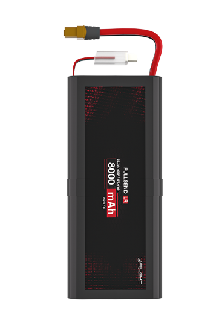
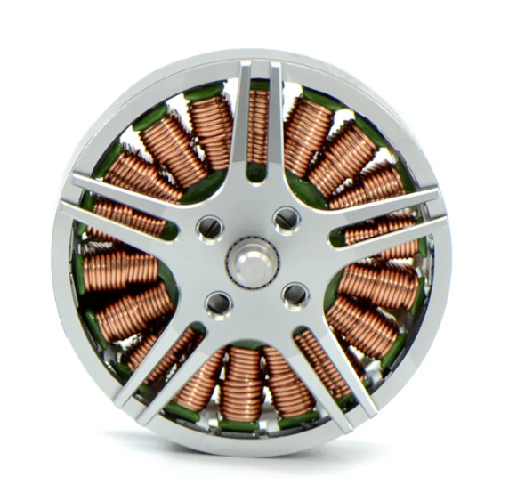
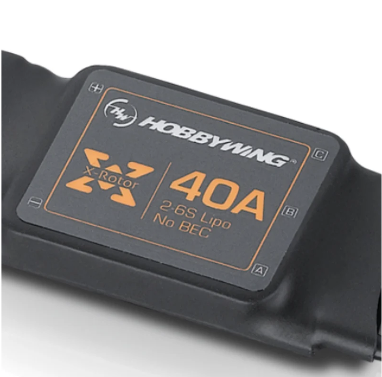
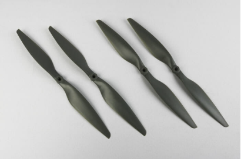
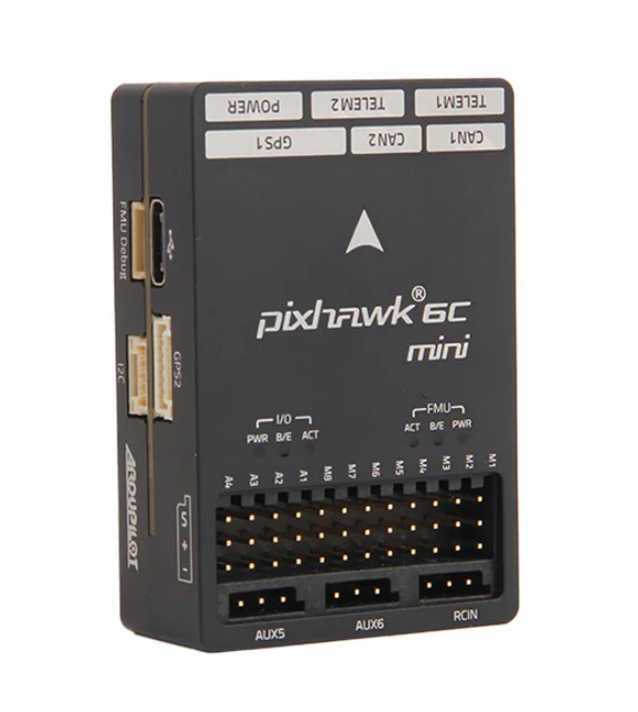
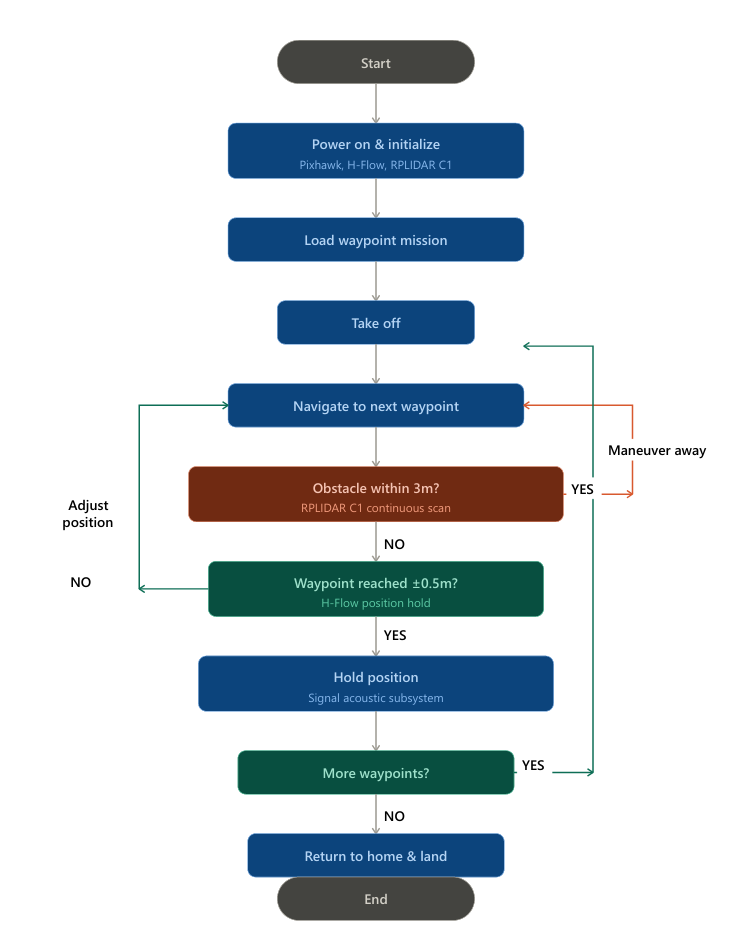

# Conceptual Design

This document outlines the objectives of a conceptual design. After reading your conceptual design, the reader should understand:

- The fully formulated problem.
- The fully decomposed conceptual solution.
- Specifications for each of the atomic pieces of the solution.
- Any additional constraints and their origins.
- How the team will accomplish their goals given the available resources.

With these guidelines, each team is expected to create a suitable document to achieve the intended objectives and effectively inform their stakeholders.

## General Requirements for the Document
- Submissions must be composed in Markdown format. Submitting PDFs or Word documents is not permitted.
- All information that is not considered common knowledge among the audience must be properly cited.
- The document should be written in the third person.
- An introduction section should be included.
- The latest fully formulated problem must be clearly articulated using explicit "shall" statements.
- A comparative analysis of potential solutions must be performed
- The document must present a comprehensive, well-specified high-level solution.
- The solution must contain a hardware block diagram.
- The solution must contain an operational flowchart.
- For every atomic subsystem, a detailed functional description, inputs, outputs, and specifications must be provided.
- The document should include an acknowledgment of ethical, professional, and standards considerations, explaining the specific constraints imposed.
- The solution must include a refined estimate of the resources needed, including: costs, allocation of responsibilities for each subsystem, and a Gantt chart.

## Introduction

&nbsp; &nbsp; &nbsp; &nbsp; In large stadiums and performance venues, sound systems are designed to provide clear and consistent audio coverage across wide audience areas. However, listeners often experience variations in clarity, timing, and tonal balance depending on their seating location. Music or speech may appear delayed, uneven, or less intelligible in certain regions of the venue. These issues commonly arise from timing misalignment between distributed loudspeaker systems and from insufficient spatial resolution in acoustic measurements during system tuning.

&nbsp; &nbsp; &nbsp; &nbsp; This project addresses these challenges by focusing not only on the alignment of delay systems, but also on improving the spatial density, consistency, and usability of acoustic measurement data across the entire sound system. By leveraging acoustic measurement tools and system-tuning software such as Smaart, the project aims to develop a practical and repeatable workflow that enables engineers to evaluate system performance more effectively and make informed adjustments based on spatially distributed data.

&nbsp; &nbsp; &nbsp; &nbsp; The objective is to optimize loudspeaker timing, coverage, and tonal balance throughout the venue rather than at isolated measurement locations. By improving how acoustic data is collected and utilized during system tuning, the proposed workflow seeks to support clearer, more consistent sound reproduction across the entire audience area while aligning with real-world measurement practices.

## Restating the Fully Formulated Problem

&nbsp; &nbsp; &nbsp; &nbsp; Modern live-event production depends on sound reinforcement systems capable of delivering consistent coverage, clarity, and tonal balance across diverse venues. Achieving these outcomes requires accurate characterization of acoustic energy propagation throughout the listening environment, including the combined effects of direct sound, reflections, and reverberation. Sound-system engineering relies heavily on objective acoustic measurements to support loudspeaker alignment, equalization, and overall system optimization.

&nbsp; &nbsp; &nbsp; &nbsp; In current professional workflows, acoustic measurements are performed by manually repositioning a measurement microphone throughout the audience area. These measurements are analyzed using industry-standard tools such as Smaart to evaluate system performance in terms of frequency response, timing, and level consistency. While this methodology is well established and widely accepted, it is inherently limited by the time, labor, and accessibility constraints associated with manual microphone placement.

&nbsp; &nbsp; &nbsp; &nbsp; As a result, only a limited number of spatial measurement locations can typically be sampled during the setup period of a live event. This restricts the spatial resolution of the collected acoustic data, particularly in large, architecturally complex, or multi-tiered venues. Areas such as elevated seating sections, balconies, or obstructed regions may be under-sampled or entirely unmeasured, requiring engineers to approximate system performance between measurement points.

&nbsp; &nbsp; &nbsp; &nbsp; The measured acoustic response at a given listener position reflects the combined influence of both the loudspeaker system and the acoustic environment. This response may be modeled as the convolution of the excitation signal x(t) with the acoustic impulse response h(t), producing the measured signal y(t):

$$
y(t)=x(t)∗h(t) \quad (1)
$$ 

&nbsp; &nbsp; &nbsp; &nbsp; Because the impulse response varies spatially due to room geometry, reflections, and boundary conditions, accurate characterization of venue performance requires measurements across many distributed positions. Spatial variations in acoustic behavior can occur even between nearby listener locations, making dense and repeatable sampling essential for achieving consistent system optimization.

&nbsp; &nbsp; &nbsp; &nbsp; Although modern measurement tools provide highly accurate analysis capabilities, they remain dependent on manual data acquisition and therefore inherit practical limitations related to efficiency and coverage. These limitations reduce the ability to fully characterize complex acoustic environments within the time constraints of real-world production workflows.

&nbsp; &nbsp; &nbsp; &nbsp; Therefore, the fundamental problem is the lack of an efficient and repeatable method for collecting spatially dense acoustic measurement data across a venue. Current approaches limit measurement coverage and rely heavily on manual effort, which can result in incomplete system characterization and reduced consistency in sound system performance.

### Specifications

**System Capabilities**
- The system shall autonomously navigate a defined measurement region within an indoor or outdoor performance venue.
- The system shall carry a lightweight microphone system capable of capturing acoustically meaningful data for comparative analysis of frequency response, timing, and sound pressure level trends.
- The system shall provide a continuous real-time audio signal suitable for acoustic analysis at the ground station.
- The system shall transmit audio data to a ground-station computer for real-time analysis using Smaart.
- The system shall support transfer-function-based measurement workflows using excitation signals generated by the venue loudspeaker system.
- The system shall include onboard processing hardware capable of performing signal conditioning and real-time digital signal processing prior to transmission.
  
**Modularity and Expandability**

- The system shall allow replacement or modification of sensing modules and processing components.
- The system may support alternative microphone types or upgraded front-end circuits for improved performance.
- The system may support additional onboard processing or filtering techniques for future system improvements.
- The system shall provide accessible signal and data interfaces to support integration with external analysis platforms.

**Physical Reliability**

- The system shall maintain stable operation under typical indoor venue airflow and vibration conditions.
- The system shall include protective structures to safeguard sensing and electronic components during operation and transport.
- The system shall be capable of safe landing or shutdown in the event of communication or navigation failure.
  
### Constraints

**Regulatory Compliance**

- The system shall comply with applicable aviation and indoor drone operation regulations within the deployment region.
- Wireless communication systems shall operate within approved frequency allocations for unlicensed devices.

**Operational Guidelines**

- The system shall operate only within controlled environments approved for autonomous flight testing.
- The system shall not interfere with venue audio systems or measurement signals during operation.
- The system shall provide a measurement signal that can be evaluated and captured externally by the system operator using Smaart.

**Safety and Environmental Guidelines**

- The system shall incorporate protective measures to prevent injury to personnel or damage to venue infrastructure.
- The system shall include emergency shutdown functionality to ensure safe operation in fault conditions.

# Comparative Analysis of Potential Solutions

## Frame Configuration

**Options Considered**

**1. X-Frame**
Most common quadcopter layout with symmetrical geometry.
- Pros: balanced and symmetrical layout, good maneuverability and control response, widely used with abundant replacement parts and design knowledge
- Cons: less central space for payload mounting, harder to isolate sensors from propulsion-related vibration, optimized for agility over instrument carrying
- Estimated Price: $30–$150 (carbon-fiber kits)

**2. H-Frame**
Wider center body with extended arms creating a larger middle section for electronics and payload.
- Pros: larger center area for electronics and sensors, easier to mount payloads and custom hardware, better suited for research and experimental platforms, convenient for battery placement and vibration isolation
- Cons: slightly bulkier than X-frame, creates somewhat more drag, less agile than racing-focused frames
- Estimated Price: $30–$80 (hobby-grade carbon-fiber)

**3. Deadcat Frame**
Front arms moved outward to keep propellers out of the forward camera view.
- Pros: keeps front propellers out of camera view, decent center space for components, useful for forward-facing imaging
- Cons: less symmetrical layout, not ideal for balanced sensor placement, more beneficial for video than acoustic work
- Estimated Price: $40–$90 (carbon-fiber kits)

**Selected Configuration:** H-Frame

**Justification**
The H-frame best matches the project's functional priorities for an acoustic measurement drone. Unlike racing-oriented layouts, this drone requires adequate room for microphone placement, acoustic electronics, onboard processor (Raspberry Pi), battery and wiring, and vibration-isolation mounts. The wider central body reduces packaging constraints and improves sensor placement flexibility. The slight increase in bulk is an acceptable tradeoff for stability, mounting space, and structural practicality.

## Frame Material

**Options Considered**

**1. Carbon Fiber**
Widely used in drone structures for high stiffness and low weight.
- Pros: very high strength-to-weight ratio, stiff and lightweight, common in drone frame construction, maintains structural rigidity in flight
- Cons: more expensive than plastic, harder to machine and repair, damaged parts need replacement rather than reshaping

**2. Aluminum**
Durable and easy to machine, useful for prototypes and support brackets.
- Pros: durable, easy to machine, readily available, good for brackets and support pieces
- Cons: heavier than carbon fiber, transmits more vibration, less ideal where low mass is critical

**3. 3D-Printed Plastic**
Useful for prototypes, custom brackets, and sensor mounts.
- Pros: inexpensive, easy to prototype and customize, good for sensor holders and non-critical mounts
- Cons: weaker than carbon fiber or aluminum for primary load-bearing structure, can deform or crack under repeated stress, not ideal for full structural arms

**Selected Material:** Hybrid Carbon Fiber + 3D-Printed Parts

**Justification**
This hybrid approach provides the structural advantages of carbon fiber while preserving the flexibility of additive manufacturing. Carbon-fiber arms and primary structural members provide the stiffness and low weight needed for efficient and stable flight. 3D-printed parts enable easy customization of microphone mounts, electronics brackets, and experimental sensor placements during development. This combination supports both structural performance and iterative design capability.

## 3D Printing Filament

**Options Considered**

**1. PLA**
Standard entry-level 3D printing filament.
- Pros: easy to print, inexpensive, good for quick prototypes
- Cons: brittle, lower heat resistance, not ideal for load-bearing or long-term drone parts
- Estimated Price: ~$20–$25 per 1 kg spool

**2. PETG**
Tougher and more heat-resistant than PLA.
- Pros: tougher than PLA, better heat resistance, easier to print than nylon, good layer adhesion, suitable for indoor/outdoor parts
- Cons: not as stiff as carbon-fiber reinforced materials, less ideal than engineering nylon for high-performance brackets
- Estimated Price: ~$20–$30 per 1 kg spool

**3. Nylon**
Strong and impact-resistant engineering material.
- Pros: strong and impact resistant, better for functional parts than PLA, more durable under mechanical stress
- Cons: harder to print, absorbs moisture, more demanding storage and print setup requirements
- Estimated Price: ~$30–$50 per 1 kg spool

**4. Carbon-Fiber Reinforced Nylon**
Example: MatterHackers NylonX (PA12 nylon with ~20% chopped carbon fiber).
- Pros: strong and stiff, better suited for engineering parts, useful for final brackets where rigidity matters
- Cons: expensive, requires better printer capability and filament handling, more difficult than PETG
- Estimated Price: ~$60–$70 per 0.5 kg spool

**Selected Filament:** PETG for Prototyping, Carbon-Fiber Reinforced Nylon for Final Mounts

**Justification**
PETG is selected for early prototypes because it is easier to print, durable, and reasonably priced. Carbon-fiber reinforced nylon is selected as the preferred final material for high-performance custom brackets and sensor mounts because it offers greater stiffness and strength. PLA is not selected for critical parts due to its brittleness and unsuitability for mechanically stressed drone components.

## Final Frame Design Summary

| Aspect | Selection |
|--------|-----------|
| Frame Configuration | H-Frame |
| Primary Structure | Carbon fiber |
| Custom Mounts | 3D-printed (PETG for prototyping, CF-reinforced nylon for final) |

**Justification**
This design provides the optimal balance of stability, payload space, low weight, structural strength, and custom sensor integration. The H-frame configuration is especially well suited for an acoustic measurement drone because the larger central section improves packaging and simplifies microphone placement and vibration isolation — critical factors for acoustic measurement quality. Carbon fiber supports efficient and rigid flight, while 3D-printed custom parts allow the system to adapt during testing and refinement.

## Power and Propulsion Subsystem

**Options Considered**

**Battery**
Both lithium-polymer (LiPo) and lithium-ion (Li-Ion) options were evaluated. LiPo batteries provide higher discharge rates and are commonly used in high-performance drones, while Li-Ion batteries offer higher energy density and improved endurance.

**Motors**
Two primary approaches were considered. Larger, low-KV motors such as the Tarot 4112 300KV are typically paired with larger propellers (15–16 inches) for maximum efficiency. Smaller, lighter motors such as the SunnySky V4008 380KV are better suited for mid-sized propellers (12–13 inches) and reduced overall system weight.

**Propellers**
Sizes ranging from 12-inch to 15-inch were evaluated. Larger propellers provide higher efficiency and thrust at lower RPMs but require a larger frame and increase system size. Smaller propellers allow for a more compact design but may reduce efficiency and increase power consumption.

**ESC Configuration**
Both 4-in-1 ESCs and individual ESCs were considered. A 4-in-1 ESC offers compact integration and reduced wiring, while individual ESCs provide better thermal distribution, easier replacement, and greater flexibility in larger custom frames.

**Design Considerations**

- **Endurance Requirements:** The system must support extended flight time for mapping operations, prioritizing efficiency over speed.
- **Weight Constraints:** Reducing total aircraft mass is critical for improving flight time and reducing required thrust.
- **Frame Size Limitations:** The selected 16 in × 16 in frame restricts the maximum propeller size that can be used.
- **Power Efficiency:** The propulsion system must operate efficiently at hover and low-speed cruise conditions.
- **Component Compatibility:** All components must support a 6S power system and operate within safe electrical limits.
- **Thermal and Reliability Considerations:** ESC and motor selection must ensure safe operation under continuous load conditions.
- **Integration Simplicity:** The design should allow for straightforward integration with the flight controller and payload systems.

**Selected Configuration**

**6S 8000 mAh Li-Ion Battery**

**SunnySky V4008 380KV Brushless Motors (×4)**

**HobbyWing XRotor 40A ESCs (×4)**

**APC 13×4.5 Multirotor Propellers (×4)**

**16 in × 16 in 3D-Printed H-Frame**

**Justification**
- **Battery:** Li-Ion chosen over LiPo for higher energy density, enabling longer flight times.
- **Motors:** SunnySky V4008 380KV selected over heavier alternatives to reduce total system weight while maintaining sufficient thrust capability.
- **Propellers:** 13-inch selected as a compromise between efficiency and frame constraints, providing improved performance over 12-inch props while remaining compatible with the existing frame.
- **ESCs:** Individual ESCs selected over 4-in-1 to improve thermal performance and simplify integration within the larger frame.

This configuration provides a balanced solution that meets the endurance requirements of the project while maintaining compatibility with the mechanical design. The selected components reduce unnecessary weight, improve efficiency during hover, and allow the system to achieve an estimated flight time near 20 minutes under optimized operating conditions.

## Computing Architecture

**Options Considered**

**1. Flight Controller Only**
Examples: Pixhawk 6C. Integrated IMU, barometer, and flight firmware (PX4 / ArduPilot).
- Pros: built-in stabilization, integrated sensors, fast development, reliable
- Cons: limited low-level control, less flexibility, firmware-dependent
- Estimated Price: $80–$200

**2. Custom Microcontroller**
Examples: STM32, Raspberry Pi.
- Pros: full control, highly customizable, lightweight, very low cost
- Cons: must build control and sensor fusion from scratch, high development time
- Estimated Price: $10–$30

**3. Flight Controller + Companion Microcontroller**
FC handles low-level control; MCU handles mission-specific tasks.
- Pros: combines reliability and flexibility, supports custom processing, scalable
- Cons: added complexity, communication overhead required, higher power consumption
- Estimated Price: $100–$250

**Selected Architecture:** Flight Controller Only

**Justification**
Given the simplified mission scope — preset waypoints in a flat-box venue — a standalone flight controller provides sufficient processing capability. Flight controller firmware natively handles stabilization, waypoint navigation, sensor integration, and obstacle avoidance responses without requiring a companion microcontroller. This reduces system complexity, weight, and cost.

## Flight Controller Selection

**Options Considered**

**1. Pixhawk 6C (Holybro)**
- Processor: STM32H743
- Sensors: redundant IMUs, onboard barometer and magnetometer
- Connectivity: multiple telemetry ports, dual power inputs — higher expandability and redundancy
- Estimated Price: ~$180–$220

**2. Pixhawk 6C Mini (Holybro)**
- Processor: STM32H743
- Sensors: redundant IMUs, onboard barometer and magnetometer (identical to 6C)
- Connectivity: reduced port availability, single power input — more constrained but sufficient for a fixed, well-defined system
- Estimated Price: ~$120–$150

**Selected Flight Controller:** Pixhawk 6C Mini

**Justification**
The Pixhawk 6C Mini provides identical processing and sensing performance to the full 6C while reducing cost and avoiding unnecessary expansion capability. It meets all required connectivity needs for the system and simplifies overall system design without sacrificing reliability.

## State Estimation

The state estimation subsystem determines the drone's orientation and relative motion during flight using the onboard sensors of the Pixhawk 6C Mini.

**Options Considered**

**1. IMU — ICM-42688-P and BMI055 (dual accel/gyro)**
Provides angular velocity and linear acceleration used to estimate roll, pitch, and yaw. High update rate enables real-time stabilization; dual IMUs improve reliability. Subject to drift over time and requires vibration isolation for accurate measurements.

**2. Magnetometer — IST8310 (onboard)**
Provides heading reference to correct yaw drift from the IMU. Improves directional stability during navigation between measurement points. Sensitive to magnetic interference from motors, wiring, and environment.

**3. Barometer — MS5611 (onboard)**
Provides relative altitude estimation for vertical control and level transitions. Lightweight and directly integrated with flight controller firmware. Affected by pressure variation and airflow, limiting precision at small height changes.

**4. Optical Flow / VIO**
Considered as an optional addition for relative horizontal motion estimation. Can improve short-range position hold and reduce drift during hover. Adds additional hardware and integration complexity; performance depends on surface texture and lighting.

**Selected Configuration:** Onboard IMUs (ICM-42688-P, BMI055), Onboard Magnetometer (IST8310), Onboard Barometer (MS5611)

**Justification**
The onboard sensor suite provides sufficient orientation and relative motion estimation for stable flight and control, and is fully supported by flight controller firmware with minimal additional integration. Optical flow was evaluated for state estimation but is instead implemented as a dedicated localization sensor, covered in the Localization subsection.

## Localization

The localization subsystem estimates the drone's position across the horizontal plane and altitude during autonomous indoor flight to support stable hover and waypoint execution.

**Options Considered**

**1. GPS**
Examples: Here3+, u-blox M9N. Standard satellite-based localization.
- Pros: globally accurate, well supported by ArduPilot/PX4, no additional hardware
- Cons: unreliable indoors due to signal obstruction and multipath interference

**2. Ultra-Wideband (UWB)**
Examples: Pozyx, Marvelmind. RF time-of-flight ranging between fixed anchors and a drone-mounted tag.
- Pros: centimeter-level indoor accuracy
- Cons: requires pre-installed anchor infrastructure throughout the venue, high setup overhead and cost

**3. Optical Flow + Downward Distance Sensor**
Example: Holybro H-Flow. Tracks surface features beneath the drone for horizontal velocity estimation; downward distance sensor provides altitude hold.
- Pros: self-contained, no external infrastructure, lightweight, low cost, native ArduPilot/PX4 support
- Cons: drift over long distances, performance dependent on surface texture and lighting

**Selected Localization Method:** Optical Flow + Downward Distance Sensor (Holybro H-Flow)

**Justification**
GPS is unsuitable for indoor use. UWB offers accuracy but requires anchor installation incompatible with live-event time constraints. Optical flow requires no external infrastructure, integrates natively with the Pixhawk 6C Mini, and provides sufficient stability for a low-speed preset waypoint mission in a flat-box venue.

## Obstacle Detection

The obstacle detection subsystem is responsible for identifying objects within the drone's flight path during navigation between waypoints to prevent collisions and ensure safe operation.

**Options Considered**

**1. Ultrasonic Sensors**
Examples: HC-SR04, MaxSonar EZ series. Emit sound pulses and measure return time to estimate distance.
- Pros: very low cost, simple integration
- Cons: narrow detection cone, slow update rate, susceptible to interference from drone motor noise and acoustic reflections in venue environments

**2. Single-Point ToF Sensor**
Examples: Benewake TFMini, VL53L1X. Single-axis distance measurement using time-of-flight.
- Pros: lightweight, inexpensive, UART/I2C compatible
- Cons: extremely narrow field of view (~2–3°), multiple units required for adequate coverage, increasing wiring complexity

**3. 2D Scanning LiDAR**
Example: SLAMTEC RPLIDAR C1. Rotating laser scanner providing continuous 360° horizontal distance measurements.
- Pros: full horizontal coverage with no blind spots, 12m range, 5KHz sample rate, TTL UART interface, lightweight at 110g, IP54 rated
- Cons: detects obstacles only in the horizontal plane, does not cover above or below the drone

**Selected Sensor:** SLAMTEC RPLIDAR C1

**Justification**
Ultrasonic sensors are susceptible to motor noise and provide insufficient coverage. Single-point ToF sensors require multiple units for adequate coverage, adding cost and payload weight. The RPLIDAR C1 provides full 360° coverage in a single lightweight unit, interfaces directly with the Pixhawk 6C Mini via TTL UART, and comfortably meets the demands of a low-speed waypoint mission.

## Acoustic Signal Processing Subsystem

Designing the acoustic signal processing subsystem requires careful consideration of measurement quality, system weight, integration complexity, and compatibility with real-world audio workflows. Multiple approaches exist for microphone selection, signal conditioning, processing, and transmission, each presenting tradeoffs between accuracy, practicality, and system feasibility. The following approaches are evaluated to determine a solution that balances performance with the constraints of an airborne measurement platform.

### Microphone Selection

**Options Considered**

**1. Measurement Microphone**
Example: Earthworks M30. Laboratory-grade microphone designed for highly accurate and flat frequency response across a wide bandwidth.
- Pros: highest measurement accuracy, ideal for transfer-function and impulse-response analysis
- Cons: requires 48V phantom power, physically larger and heavier, requires balanced XLR connections and external preamplifiers — not well suited for a compact, lightweight, mobile platform

**2. Prosumer Lavalier Microphone**
Example: Rode Lavalier GO. Lightweight, inexpensive, and easy to integrate with systems that support standard 3.5 mm TRS inputs.
- Pros: lightweight, inexpensive, simple integration, operates on plug-in power
- Cons: limited control over signal conditioning, lower durability and consistency compared to professional-grade options, electrical interface may not be ideal for custom analog front-end circuitry

**3. Professional Lavalier Microphone with Custom Front-End**
Example: Countryman B6 with custom-designed analog front-end.
- Pros: extremely small form factor, low weight, high durability, precise control over microphone biasing, AC coupling, and signal amplification via custom front-end, improved reliability and consistency over consumer options
- Cons: additional design complexity, sacrifices absolute measurement accuracy in favor of portability

**Selected Microphone:** Countryman B6 with Custom Analog Front-End

**Justification**
The B6 provides an extremely small form factor, low weight, and high durability, making it well suited for aerial deployment. The custom analog front-end allows for precise control over microphone biasing, AC coupling, and signal amplification, ensuring the signal is properly conditioned before digitization. This configuration sacrifices absolute measurement accuracy in favor of portability and practical implementation while still producing acoustically meaningful data for comparative analysis.

### Embedded Processing

**Options Considered**

**1. No Onboard Processing**
Raw microphone signal transmitted directly to the ground station; all filtering and analysis performed externally.
- Pros: minimizes system complexity, reduces onboard computational requirements
- Cons: drone-induced noise (rotor and vibration artifacts) remains embedded in the transmitted signal, degrading measurement quality

**2. High-Performance Embedded System**
Example: Raspberry Pi 4.
- Pros: significant computational power, supports advanced signal processing and data handling
- Cons: increased power consumption, OS overhead, boot time concerns, less desirable for lightweight embedded applications requiring deterministic real-time performance

**3. Microcontroller-Based DSP**
Example: Teensy 4.1 with audio interface.
- Pros: sufficient real-time processing capability, low power consumption, compact form factor, deterministic real-time operation, integrates well with embedded audio systems
- Cons: less raw compute than a full embedded system

**Selected Processor:** Teensy 4.1 with Audio Interface

**Justification**
The Teensy 4.1 provides sufficient real-time processing capability to implement targeted filtering to reduce predictable drone-induced noise prior to transmission. It maintains low power consumption and a compact form factor while avoiding the overhead associated with more complex embedded systems.

### Wireless Transmission

**Options Considered**

**1. Digital Wireless / Streaming**
Network-based audio streaming over modern communication protocols.
- Pros: flexible, high-quality audio transmission
- Cons: may introduce latency, synchronization challenges, increased implementation complexity, integration with existing measurement tools may require additional hardware or software configuration

**2. Wired Transmission**
Direct physical connection between drone and ground station.
- Pros: highest signal integrity, no wireless interference or compression
- Cons: impractical for a mobile aerial system, restricts movement and introduces safety risks associated with tethering

**3. Analog Wireless System**
Example: Shure ULX.
- Pros: reliable, low-latency audio transmission, widely used in professional audio environments, team already has access to the system reducing cost and enabling rapid integration
- Cons: some bandwidth limitations and signal coloration, acceptable for comparative acoustic analysis

**Selected Transmission System:** Shure ULX Analog Wireless System

**Justification**
The Shure ULX provides reliable, low-latency audio transmission compatible with professional audio workflows. Team access to the system reduces cost and enables rapid integration and testing. While analog wireless may introduce minor bandwidth limitations, these effects are acceptable for comparative acoustic analysis and the benefits of reliability, simplicity, and workflow compatibility outweigh them.

## Controller Subsystem

The controller subsystem serves as the operator-facing control center for the autonomous acoustic measurement drone. Its role is to supervise an autonomous mission, display vehicle status and mission progress, allow emergency manual takeover, and interface with the coding subsystem that executes the drone's preset measurement path. The controller must be compact, packageable into a custom 3D-printed housing, responsive for emergency override, capable of running a graphical interface, compatible with analog joystick inputs, and able to maintain a reliable radio link to the aircraft.

**Options Considered**

**1. Microcontroller-Centered Controller**
Example: Raspberry Pi Pico 2 W. Built-in wireless capability, analog input support, and simple embedded architecture.
- Pros: lightweight, low-power, deterministic, fast to boot, simple real-time input handling
- Cons: poorly suited for a mission-supervision role requiring screen-based interfaces, telemetry awareness, fault presentation, and future software expansion — better suited as a minimalist transmitter than a handheld mission computer

**2. Linux-Based Controller Without Touchscreen**
Example: Raspberry Pi Zero 2 W with minimal or no integrated display.
- Pros: capable of supporting real interfaces, logs, mission-state handling, and telemetry display; compact form factor
- Cons: non-touch or minimal display weakens the supervisory user experience and limits future features such as mission selection, fault prompts, and configuration pages

**3. Linux-Based Controller with Touch HDMI Display and External ADC**
Raspberry Pi Zero 2 W paired with a touchscreen and MCP3008 external ADC for analog joystick inputs (Zero 2 W provides no native analog inputs).
- Pros: preserves Zero 2 W flexibility, solves joystick-input problem directly, touchscreen enables full supervisory interface, aligns with mission-computer role
- Cons: requires external ADC for joystick inputs, more components than simpler options

**4. Zero 2 W Controller with ELRS Radio Link**
ExpressLRS-based 900 MHz or 2.4 GHz radio link paired with the Zero 2 W architecture.
- Pros: high-performance, low-latency, broad ecosystem support and tooling, large user base
- Cons: optimized around a traditional RC ecosystem; less naturally aligned with a bidirectional supervisory-communication and telemetry architecture

**5. Zero 2 W Controller with mLRS 915 MHz Radio Link**
Matek mR900-30-TX and mR900-30 receiver. Bidirectional MAVLink serial connection combined with full remote control in 915 MHz FCC operation.
- Pros: bridges supervisory telemetry and manual RC control in a single radio link, naturally aligned with the project's mission-computer architecture, 915 MHz avoids regional frequency ambiguity
- Cons: smaller ecosystem than ELRS

**6. Power — Zero-Specific UPS HAT**
Example: Waveshare UPS HAT (C). Purpose-built Zero-series UPS module with a single 803040 1000 mAh 3.7V Li-Po cell.
- Pros: compact, purpose-built for the Zero form factor
- Cons: insufficient power budget once touchscreen, radio module, ADC, joysticks, and future expansion are included

**7. Power — 3S External UPS Module with 18650 Cells**
Example: Waveshare UPS Module 3S with Samsung 35E flat-top 18650 cells (~3500 mAh, 3.6V nominal, 8A continuous).
- Pros: more robust power budget, stable regulated output, fits well into a custom 3D-printed enclosure, Samsung 35E cells well-matched to a low-current supervisory load where runtime matters more than discharge performance
- Cons: larger than a HAT-style solution, requires accommodation in housing design

**Design Considerations**

- **Role Definition:** The controller is a mission-supervision device with manual override capability, not a traditional RC handset — favoring a Linux-capable platform over a minimalist transmitter.
- **Interface Quality:** Operator must monitor autonomy state, mission progress, battery status, and fault conditions — requiring a readable, touch-enabled display. The Waveshare 5-inch HDMI LCD (H) (800×480, capacitive 5-point touch, tempered glass) meets this need and is compatible with the Zero 2 W mini HDMI output.
- **Analog Input Compatibility:** The Zero 2 W provides no native analog inputs; an external ADC (MCP3008, 8-channel 10-bit SPI) is required to keep conventional joystick hardware in the design.
- **Radio Architecture:** A radio family natively supporting bidirectional serial/telemetry alongside RC control is more appropriate than one optimized purely for the RC ecosystem, strongly favoring mLRS over ELRS for this project.
- **Power Margin and Packaging:** The full controller subsystem (Pi, touchscreen, radio, physical controls) requires more power headroom than a Pi-only UPS HAT provides. The 3S module with loose 18650 cells better matches the actual duty and fits the custom 3D-printed housing.
- **Future Expandability:** The chosen architecture provides room for richer menus, better fault handling, configuration pages, onboard logging, and tighter integration with the coding subsystem.

**Selected Configuration**

**Raspberry Pi Zero 2 W** — main controller computer

**Waveshare 5inch HDMI LCD (H)** — touchscreen interface

**MCP3008** — external ADC for analog joystick channels

**Matek mR900-30-TX and mR900-30** — 915 MHz radio link

**Waveshare UPS Module 3S** — controller power board

**Samsung 35E flat-top 18650 cells** — controller battery set

**Custom 3D-printed controller housing** — manufactured using the same filament selected in the frame subsystem

**Justification**
This solution was selected because it best satisfies the full operating role of the controller subsystem. It was chosen over a microcontroller-centered design because the project needs a real handheld mission computer, not just a signal generator for joysticks and switches. It was chosen over a minimal-display approach because the touch-enabled 5-inch display improves clarity, expandability, and day-to-day usability. It was chosen over ELRS because the mLRS architecture is naturally aligned with bidirectional supervisory communication plus remote control — a major advantage for a custom controller working closely with the coding subsystem. The 3S UPS module and loose 18650 cells were chosen over the smaller HAT-style option to provide sufficient power headroom for the full handheld build.

## High-Level Solution

&nbsp; &nbsp; &nbsp; &nbsp; The proposed solution is an autonomous aerial acoustic measurement system designed to improve the efficiency, consistency, and spatial resolution of sound system analysis in performance venues. The system integrates a multirotor drone platform with acoustic sensing hardware, onboard signal conditioning, and wireless communication to enable the collection of spatial acoustic data. This approach addresses the limitations of traditional manual measurement workflows by enabling repeatable, high-density sampling across large and complex environments.

&nbsp; &nbsp; &nbsp; &nbsp; The system operates by executing a predefined set of measurement waypoints distributed throughout the venue. As the drone navigates through these locations, it continuously captures and transmits acoustic data rather than relying on discrete measurement windows. The onboard acoustic subsystem provides a real-time, conditioned audio signal that is transmitted to a ground-station computer. At the ground station, the signal is analyzed using industry-standard tools such as Smaart, where the system operator determines when measurement conditions are appropriate and captures data accordingly.

&nbsp; &nbsp; &nbsp; &nbsp; To satisfy stakeholder requirements, the design prioritizes measurement usefulness, operational efficiency, and safety. Measurement usefulness is achieved through the use of a lightweight electret microphone system, specifically the Countryman B6, combined with a custom analog front-end and onboard digital signal processing. The analog front-end provides biasing, AC coupling, and low-noise preamplification, while the onboard DSP reduces predictable drone-induced noise such as rotor and vibration artifacts prior to wireless transmission. Although the system does not utilize a laboratory-calibrated measurement microphone, it is designed to produce acoustically meaningful data suitable for comparative spatial analysis.

&nbsp; &nbsp; &nbsp; &nbsp; Operational efficiency is improved through autonomous navigation and continuous data availability. By eliminating the need for manual microphone repositioning and discrete capture control, the system enables rapid data collection across multiple positions while allowing the operator to evaluate signal quality in real time. This supports increased spatial sampling density and more flexible measurement workflows within the time constraints typical of live-event environments.

&nbsp; &nbsp; &nbsp; &nbsp; Safety and regulatory compliance are addressed through controlled flight behavior, reduced operating speeds, and the inclusion of fail-safe mechanisms such as emergency shutdown and controlled landing procedures. The system is intended to operate within controlled indoor environments while minimizing risk to personnel and venue infrastructure.

&nbsp; &nbsp; &nbsp; &nbsp; The solution is decomposed into five primary subsystems: the drone frame, external components, internal components, digital signal processing (DSP), and the controller with associated software and user interface. Each subsystem performs a distinct function and is designed with clearly defined interfaces to ensure reliable integration.

&nbsp; &nbsp; &nbsp; &nbsp; The drone frame provides the structural platform and mounting points for all hardware components. The external components subsystem includes propulsion and power elements such as motors, propellers, electronic speed controllers, and the battery, which enable flight and power distribution. The internal components subsystem includes sensors and supporting electronics required for stabilization and state estimation. The DSP subsystem is responsible for acoustic signal acquisition, analog front-end conditioning, real-time digital processing, and wireless transmission. The controller subsystem manages flight control, autonomy, system coordination, and provides the interface between the drone and the operator.

&nbsp; &nbsp; &nbsp; &nbsp; Risks associated with the system, including positional inaccuracies, communication delays, and acoustic contamination from drone noise, are mitigated through design strategies such as stable waypoint hovering, continuous signal monitoring, and targeted onboard signal conditioning. The use of operator-controlled measurement capture further reduces the likelihood of recording invalid or low-quality data by ensuring that measurements are taken only under acceptable conditions.

&nbsp; &nbsp; &nbsp; &nbsp; Finally, the design optimizes resource utilization by leveraging commercially available drone platforms, wireless audio systems, and established acoustic measurement software. This approach reduces development complexity and cost while maintaining flexibility and compatibility with existing industry workflows.

&nbsp; &nbsp; &nbsp; &nbsp; Overall, the proposed solution provides a practical and technically feasible method for autonomous acoustic measurement, enabling improved data collection, reduced labor requirements, and enhanced sound system evaluation in real-world venue environments.

### Hardware Block Diagram

### Operational Flow Chart

Similar to a block diagram, the flow chart aims to specify the system, but from the user's point of view rather than illustrating the arrangement of each subsystem. It outlines the steps a user needs to perform to use the device and the screens/interfaces they will encounter. A diagram should be drawn to represent this process. Each step should be represented in the diagram to visually depict the sequence of actions and corresponding screens/interfaces the user will encounter while using the device.

# Atomic Subsystem Specifications

## Frame Subsystem

**Functional Description**

The frame subsystem provides the structural foundation of the aircraft and supports all onboard components, including the propulsion system, power system, sensing subsystem, and onboard processing hardware. The frame maintains the geometric configuration required for stable multirotor flight while ensuring that all components are securely mounted and properly aligned.

In addition to structural support, the frame subsystem is responsible for minimizing vibration transmission from the propulsion system to sensitive acoustic measurement components. This is critical because vibration can introduce noise into microphone signals and degrade measurement accuracy.

The selected frame is a carbon-fiber H-frame with a nominal size of **16 in × 16 in**, using carbon-fiber structural members and 3D-printed mounts for component integration and vibration isolation.

---

**Subsystem Connections**

| Interface | Signal Type | Direction | Protocol / Format | Data |
|-----------|-------------|-----------|-------------------|------|
| Frame → Power & Propulsion | Mechanical | Output | Physical mounting | Motor, ESC, and battery mount points; power wiring routing support |
| Frame → Control & Processing | Mechanical | Output | Physical mounting | Vibration-isolated mounting surfaces for flight controller and onboard computer |
| Frame → Sensing (Acoustic + Navigation) | Mechanical | Output | Physical mounting | Sensor and microphone mount points; vibration isolation for signal integrity |
| Frame → Communication | Mechanical | Output | Physical mounting | Antenna and communication module mount points |

---

**Detailed Operation**

During operation, the frame acts as the central structural platform that supports all subsystems. The propulsion system generates thrust forces at the ends of the frame arms, which are transmitted through the carbon-fiber structure. The frame maintains alignment between motors and ensures that thrust is distributed symmetrically.

The battery and onboard electronics are mounted near the center of mass to maintain stability and reduce rotational inertia. Sensors, including microphones, are mounted using vibration-isolated brackets to minimize noise interference.

The frame also serves as a routing structure for wiring and component integration. Proper spacing and layout reduce electromagnetic interference and improve maintainability.

The frame subsystem does not have a direct user interface; however, its operation within the system can be described as follows:

1. Support component mounting
2. Maintain structural integrity during flight
3. Distribute loads from propulsion system
4. Minimize vibration transmission
5. Maintain alignment of all subsystems
6. Enable safe landing and structural durability

---

**Performance Specifications**

- Frame configuration: H-frame
- Frame size: 16 in × 16 in
- Frame material: carbon fiber
- Secondary materials: PETG or carbon-fiber reinforced nylon
- Estimated frame weight: 400–500 g
- Structural load capacity: ≥ 2.3 kg total aircraft mass
- Vibration isolation capability: reduce transmission of motor-induced vibration to sensors
- Mounting capability: support propulsion, power, sensing, and control subsystems
- Modularity: allow component removal and replacement

---

**Detailed Shall Statements**

**Functional Requirements**
- The subsystem shall provide structural support for all onboard components.
- The subsystem shall maintain geometric alignment required for stable multirotor flight.
- The subsystem shall provide mounting interfaces for all subsystems.

**Mechanical Requirements**
- The subsystem shall use carbon fiber as the primary structural material.
- The subsystem shall maintain sufficient stiffness to prevent structural deformation during flight.
- The subsystem shall support a minimum total load of 2.3 kg.

**Interface Requirements**
- The subsystem shall provide mounting points for motors, ESCs, battery, and electronics.
- The subsystem shall support routing of electrical wiring between subsystems.
- The subsystem shall allow secure mounting of sensors and communication devices.

**Vibration Requirements**
- The subsystem shall minimize vibration transmission to acoustic sensors.
- The subsystem shall support vibration isolation mechanisms for sensitive components.

**Weight Requirements**
- The subsystem shall minimize structural mass to improve flight efficiency.
- The subsystem shall maintain a total frame mass between 400 g and 500 g.

**Validation Requirements**
- The subsystem shall be validated through structural inspection and load testing.
- The subsystem shall be validated through flight testing for stability and vibration performance.
- The subsystem shall demonstrate durability under repeated operation.

---

**Major Data Elements**
- frame mass
- structural load capacity
- vibration characteristics
- mounting geometry
- subsystem interface locations

---

## Power and Propulsion Subsystem

**Functional Description**

The power and propulsion subsystem is responsible for storing electrical energy, distributing that energy to the propulsion hardware, and generating the thrust required for takeoff, hover, maneuvering, and landing. The subsystem consists of a 6S lithium-ion battery, a power module, four electronic speed controllers, four brushless motors, and four multirotor propellers.

The battery serves as the primary onboard energy source. Electrical power from the battery is delivered directly to the ESCs for propulsion and to a power module for flight controller operation. The power module steps down the battery voltage to a regulated 5V supply required by the flight controller and provides real-time voltage and current measurements for system monitoring and safety.

The ESCs regulate power delivered to each motor, which convert electrical energy into rotational motion. The propellers then convert this motion into thrust. Together, these components provide the lift and control authority needed for stable autonomous mapping flight.

The propulsion configuration uses the iFlight Fullsend 6S 8000 mAh Li-Ion battery, a Holybro-compatible power module, HobbyWing XRotor 40A ESCs, SunnySky V4008 380KV motors, and APC 13×4.5 multirotor propellers. This configuration reduces overall propulsion weight while maintaining sufficient power capability for the expected aircraft mass.

---

**Design Justification**

The selected components prioritize endurance, efficiency, and compatibility with the custom 16 in × 16 in frame. The 6S 8000 mAh Li-Ion battery was selected due to its high energy density, enabling longer flight times compared to equivalent LiPo batteries.

The SunnySky V4008 380KV motors were selected in place of heavier alternatives to better match the 13-inch propeller size and reduce total system weight, improving flight time potential. The APC 13×4.5 propellers provide an effective balance between efficiency and frame constraints, offering improved hover efficiency while remaining compatible with the selected frame.

The HobbyWing XRotor 40A ESCs provide sufficient current capacity and reliable 6S operation. Individual ESCs were selected instead of a 4-in-1 configuration to improve thermal performance, increase system reliability, and simplify integration within the larger frame.

The power module is required to safely power the flight controller by stepping down the battery voltage and enabling real-time power monitoring. This improves system safety and allows the flight controller to implement battery-aware control strategies such as low-voltage failsafes.

---

**Subsystem Objectives**

The power and propulsion subsystem shall:
- store and distribute electrical energy for the aircraft
- provide sufficient thrust for takeoff, hover, maneuvering, and landing
- support stable and efficient autonomous mapping flight
- reduce total propulsion weight while maintaining adequate thrust margin
- operate from a 6S battery architecture
- include a power module to regulate voltage and support flight controller operation
- provide an estimated flight time near 20 minutes under endurance-focused flight conditions

---

**Subsystem Connections**

| Interface | Signal Type | Direction | Protocol / Format | Data |
|-----------|-------------|-----------|-------------------|------|
| Battery → ESCs | Electrical (DC) | Output | Direct power bus | High-current propulsion power |
| Battery → Power Module | Electrical (DC) | Output | Direct power bus | Battery voltage and current for regulation and monitoring |
| Power Module → Flight Controller | Electrical (DC) | Output | Regulated 5V | Stable 5V power supply |
| Power Module → Flight Controller | Digital | Output | Analog/ADC | Voltage and current telemetry |
| Flight Controller → ESCs | Digital | Output | PWM | Motor speed commands |
| ESCs → Motors | Electrical (AC 3-phase) | Output | 3-phase drive | Regulated motor drive current |
| Motors → Propellers | Mechanical | Output | Direct shaft | Rotational force → thrust |

---

**Detailed Operation**

During operation, the battery supplies DC power to both the propulsion system and the power module. The power module regulates the battery voltage to a stable 5V output used by the flight controller and provides voltage and current feedback for monitoring.

Each ESC receives battery power and a control signal from the flight controller, then regulates the three-phase output delivered to its corresponding motor. Each motor rotates its propeller at the speed commanded by the flight controller. By varying motor speeds, the system generates the thrust and control forces required for stable flight.

The use of lighter motors reduces total propulsion mass and improves endurance. During hover and mapping flight, the propulsion system operates below maximum power, maintaining safe thermal and electrical margins while supporting extended flight duration.

---

**Functional Flowchart**

---

**Performance Specifications**

Battery:
- Voltage: 22.2V nominal
- Capacity: 8000 mAh
- Energy: 177.6 Wh
- Weight: 840 g

Power Module:
- Input voltage: 2S–12S
- Output voltage: ~5.2V regulated
- Current rating: 60A continuous
- Weight: ~24 g

Motors (×4):
- KV: 380KV
- Max continuous power: 500W each
- Weight: 105 g each

ESCs (×4):
- Current rating: 40A continuous, 60A peak
- Voltage compatibility: 2S–6S
- Weight: 26 g each

Propellers (×4):
- Size: 13×4.5 in
- Weight: 24.1 g each

Mass Summary:
- Estimated propulsion subsystem mass: 1460.4 g
- Estimated total aircraft mass: 2206.4 g before additional hardware
- Estimated realistic flight mass: approximately 2.2–2.3 kg

Flight Time Estimates:
- Usable battery energy: 142–151 Wh
- Average flight power: 350–500 W
- Estimated flight time: approximately 17–26 minutes
- Realistic mission estimate: approximately 18–22 minutes

---

**Weight Breakdown**

Non-propulsion components:
- Flight controller: 46.8 g
- Power module: 24 g
- H-Flow sensor: 15.2 g
- RPLIDAR C1: 110 g
- DSP/Teensy subsystem: 50 g
- 3D-printed frame: 500 g
- Non-propulsion subtotal: 746.0 g

Propulsion components:
- Battery: 840 g
- Motors: 420 g
- ESCs: 104 g
- Propellers: 96.4 g
- Propulsion subtotal: 1460.4 g

Estimated total mass: 746.0 g + 1460.4 g = 2206.4 g

---

**Flight Time Calculation**

Battery energy: 22.2V × 8.0 Ah = 177.6 Wh

Usable battery energy:
- 80% usable: 142.1 Wh
- 85% usable: 151.0 Wh

Estimated flight time:
- At 350W: 24.4–25.9 minutes
- At 425W: 20.1–21.3 minutes
- At 500W: 17.1–18.1 minutes

A flight time near 20 minutes is achievable if the system maintains an average power draw of approximately 425–450W.

---

**Detailed Shall Statements**

**Functional Requirements**
- The subsystem shall provide electrical power for propulsion and flight control systems.
- The subsystem shall include one battery, one power module, four ESCs, four motors, and four propellers.
- The subsystem shall generate sufficient thrust for all flight phases.

**Weight and Efficiency Requirements**
- The subsystem shall minimize total mass while maintaining performance.
- The subsystem shall support a target aircraft mass near 2.2 kg.
- The subsystem shall support at least 18 minutes of flight time.
- The subsystem shall target a flight time near 20 minutes under optimal conditions.

**Electrical Requirements**
- The subsystem shall operate from a 6S battery.
- The subsystem shall include a power module to regulate voltage for the flight controller.
- The subsystem shall operate within safe voltage and current limits.

**Validation Requirements**
- The subsystem shall be validated through weight measurement and flight testing.
- The subsystem shall demonstrate stable operation without overheating.
- The subsystem shall demonstrate sufficient endurance for mapping missions.

---

**Major Data Elements**
- total propulsion mass
- total aircraft mass
- usable battery energy
- average power consumption
- estimated flight time

---

## Internal Components Subsystem

**Functional Description**

The internal components subsystem integrates the flight controller, localization sensor, and obstacle detection sensor into a unified system responsible for autonomous navigation, position estimation, and collision avoidance during the acoustic measurement mission.

The Pixhawk 6C Mini serves as the central processing unit for all flight operations. It receives sensor data from the H-Flow and RPLIDAR C1, executes the predefined waypoint mission, and manages stabilization throughout flight. Upon arriving at each waypoint, the Pixhawk holds position while the acoustic measurement subsystem captures data, then proceeds to the next waypoint.

The Holybro H-Flow module provides continuous optical flow and downward distance data to the Pixhawk via DroneCAN, enabling stable indoor position hold without GPS. The sensor tracks surface features beneath the drone to estimate horizontal velocity and uses a time-of-flight distance sensor for altitude hold.

The SLAMTEC RPLIDAR C1 performs continuous 360° horizontal scanning and transmits angle and distance data to the Pixhawk via TTL UART. The flight controller monitors incoming scan data and actively maneuvers the drone to maintain a minimum safe distance of 3 meters from any detected obstacle in any horizontal direction at all times. The RPLIDAR C1 is mounted with a fixed forward reference aligned to the drone's heading axis, allowing the flight controller to map scan angles to real-world directions for accurate directional response.

---

**Subsystem Connections**

| Interface | Signal Type | Direction | Protocol / Format | Data |
|-----------|-------------|-----------|-------------------|------|
| H-Flow → Pixhawk 6C Mini | Digital | Input | DroneCAN (CAN1/CAN2) | Optical flow velocity, downward distance |
| RPLIDAR C1 → Pixhawk 6C Mini | Digital | Input | TTL UART (TELEM2) | 360° obstacle distance and angle data |
| Pixhawk 6C Mini → ESCs | Digital | Output | PWM | Motor speed commands |
| Power Module → Pixhawk 6C Mini | Electrical (DC) | Input | Regulated 5V | Flight controller power |
| Power Module → Pixhawk 6C Mini | Digital | Input | Analog/ADC | Battery voltage and current telemetry |
| mLRS Receiver → Pixhawk 6C Mini | Digital | Input | CRSF / SBUS / MAVLink | RC control inputs and supervisory commands |
| Pixhawk 6C Mini → mLRS Receiver | Digital | Output | MAVLink (serial) | Telemetry, mode state, mission progress, fault data |

---

**Detailed Operation**

The Pixhawk 6C Mini serves as the central flight controller, managing stabilization, waypoint navigation, and sensor integration. The H-Flow sensor provides continuous optical flow and altitude data via DroneCAN, enabling indoor position hold. The RPLIDAR C1 performs 360° horizontal scanning and transmits distance data via TTL UART, allowing the flight controller to detect and respond to obstacles by maintaining a minimum 3-meter clearance in all horizontal directions.

---

**Functional Flowchart**

---

**Performance Specifications**

- Positional accuracy: ±0.5 meters at each waypoint
- Minimum obstacle clearance: 3 meters in all horizontal directions
- RPLIDAR C1 detection range: minimum 6 meters
- H-Flow operation: indoor position hold without GPS
- Combined subsystem weight: ≤ 200 g

---

**Applicable Standards**

**FAA Part 107** — Regulates autonomous drone operation under U.S. federal law, including maximum altitude, weight limits, and operational safety requirements.

---

**Implementation & Compliance**

- The Pixhawk 6C Mini firmware enforces altitude and speed limits in accordance with FAA Part 107 operational requirements.
- Emergency failsafe behaviors including controlled landing and return-to-home are configured within the flight controller firmware to ensure safe operation in fault conditions.
- The RPLIDAR C1 operates within Class 1 laser safety standards, posing no risk to personnel during venue operation.

---

**Design Considerations**

- The RPLIDAR C1 must be mounted with a consistent forward reference relative to the drone's heading axis to ensure accurate directional obstacle response.
- Vibration isolation should be considered for the Pixhawk 6C Mini to maintain accurate IMU measurements during flight.
- The H-Flow sensor must be mounted facing downward with an unobstructed view of the floor surface to ensure reliable optical flow performance.
- Surface texture and lighting conditions within the venue may affect H-Flow performance and should be evaluated during testing.

---

**Detailed Shall Statements**

- The Pixhawk 6C Mini shall serve as the central flight controller, managing stabilization, waypoint navigation, and sensor integration.
- The flight controller shall navigate to each predefined waypoint with a positional accuracy of ±0.5 meters.
- The flight controller shall maintain stable hover at each measurement waypoint within the venue.
- The flight controller shall execute a predefined waypoint mission without requiring manual input during flight.
- The flight controller shall actively maneuver the drone to maintain a minimum safe distance of 3 meters from any detected obstacle in the horizontal plane at all times.
- The H-Flow sensor shall provide continuous optical flow and altitude data to the flight controller via DroneCAN protocol.
- The H-Flow sensor shall support indoor position hold without reliance on GPS.
- The RPLIDAR C1 shall perform continuous 360° horizontal scanning and transmit distance data to the flight controller via TTL UART.
- The RPLIDAR C1 shall detect obstacles within a minimum range of 6 meters.
- The RPLIDAR C1 shall be mounted with a fixed forward reference aligned to the drone's heading axis to enable directional obstacle response.
- The internal components subsystem shall have a combined weight not exceeding 200 g.

---

## Acoustic Signal Processing Subsystem

**Functional Description**

The acoustic signal processing subsystem is responsible for acquiring, conditioning, and processing audio signals collected by a lightweight microphone system mounted on the drone. The subsystem provides a continuous, real-time audio signal suitable for acoustic analysis using Smaart at the ground station.

The subsystem utilizes a compact electret microphone interfaced through a custom-designed analog front-end circuit. This front-end provides microphone biasing, AC coupling, and low-noise preamplification to convert the raw microphone signal into a conditioned analog signal suitable for digitization.

The conditioned signal is digitized and processed by a Teensy-based embedded digital signal processing platform, where real-time filtering is applied to reduce predictable drone-induced noise such as rotor and vibration artifacts. The processed signal is continuously output as an analog signal.

The analog output is passed through an output conditioning stage and transmitted via a Shure wireless system to the ground station. The received signal is then analyzed using Smaart, where the system operator selects appropriate moments to capture measurements based on signal quality and stability.

---

**Design Justification**

The selection of a lightweight electret microphone and wireless transmission system represents a design tradeoff between measurement accuracy and system feasibility. Traditional acoustic measurement systems rely on calibrated condenser microphones requiring phantom power; however, these systems introduce significant weight, power consumption, and integration complexity, making them impractical for use on an aerial platform.

The proposed design utilizes a Countryman B6 electret microphone combined with a custom analog front-end circuit, allowing precise control over biasing, gain structure, and signal conditioning prior to digital processing. This approach enables improved signal integrity compared to directly interfacing the microphone with a wireless transmitter.

Onboard digital signal processing using the Teensy platform allows the subsystem to reduce predictable drone-induced noise before wireless transmission. Performing this processing at the source improves the usability of the transmitted signal and reduces reliance on post-processing.

The system provides a continuous audio stream rather than discrete measurement capture. This design aligns with professional measurement workflows, where the operator uses Smaart to evaluate signal quality, coherence, and environmental conditions before capturing measurement data.

While the system does not achieve laboratory-grade measurement accuracy, it provides sufficient fidelity for comparative acoustic analysis, including spatial variations in level, timing, and general frequency response behavior. This approach improves system robustness by maintaining a human-in-the-loop measurement process, reducing the risk of capturing invalid or noisy data.

---

**Subsystem Objectives**

The acoustic signal processing subsystem shall:
- acquire audio using a lightweight electret microphone suitable for airborne operation
- implement a custom analog front-end including biasing, AC coupling, and preamplification
- digitize and process the microphone signal using onboard DSP
- apply real-time digital filtering to reduce predictable drone-induced noise
- provide a continuous real-time audio output suitable for analysis using Smaart
- support wireless transmission of conditioned audio to the ground station
- maintain compatibility with industry-standard acoustic measurement workflows

---

**Subsystem Connections**

**External Interfaces**

| Interface | Signal Type | Direction | Protocol / Format | Data |
|-----------|-------------|-----------|-------------------|------|
| B6 Microphone → Front-End | Analog (mic-level) | Input | Electret biased analog | Acoustic pressure signal |
| Front-End → Teensy | Analog | Input | Line-level analog | Conditioned signal |
| Teensy → Wireless Transmitter | Analog | Output | Conditioned line-level | Processed audio |
| Wireless Transmitter → Receiver | RF | Output | Shure wireless system | Audio signal |
| Wireless Receiver → Audio Interface | Analog | Input | Line-level | Received audio |
| Audio Interface → Smaart | Digital | Input | USB / audio driver | Measurement signal |

**Internal Interfaces**

| Interface | Signal Type | Direction | Protocol | Data |
|-----------|-------------|-----------|----------|------|
| Mic Front-End → Teensy ADC | Analog | Input | ADC (audio shield) | Conditioned signal |
| DSP Processing (internal) | Digital | Internal | Audio library | Filtered samples |
| Teensy DAC → Output Stage | Analog | Output | DAC | Processed audio |
| System Timing | Digital | Input | Clock | DSP timing reference |

---

**Detailed Operation**

The acoustic signal processing subsystem operates as a continuous onboard audio conditioning and transmission chain. During operation, the Countryman B6 microphone converts acoustic pressure into a low-level electrical signal. This signal is routed into a custom analog front-end, which provides microphone biasing, removes DC components through AC coupling, and amplifies the signal using a low-noise preamplifier to a level suitable for digitization.

The conditioned signal is digitized by the Teensy audio system and processed in real time. The primary objective of this processing stage is to reduce predictable drone-induced noise — such as low-frequency rotor and vibration artifacts — while preserving the integrity of the acoustic signal.

Following processing, the signal is converted back to analog and passed through an output conditioning stage. This stage prepares the signal for compatibility with the Shure wireless transmitter by providing appropriate DC blocking, signal level control, and electrical interfacing.

The processed audio is transmitted continuously to the ground station, where it is received and analyzed using Smaart. Measurement capture is not controlled by the onboard system; instead, the operator monitors the live signal and determines when conditions are suitable for taking measurements. This allows for human verification of signal quality, coherence, and environmental conditions before accepting data.

---

**Functional Flowchart**

---

**Performance Specifications**

- Frequency analysis range: 20 Hz to 20 kHz (practical usable band)
- Relative frequency response consistency: within ±3 dB across repeated measurements
- Sampling rate: ≥ 44.1 kHz
- Continuous real-time audio output suitable for analysis using Smaart
- Signal-to-noise ratio sufficient to allow meaningful analysis in typical venue conditions
- Drone-induced noise reduced such that it does not dominate the measurement signal within the usable frequency band
- Repeatability: within ±3 dB across identical spatial positions under similar conditions

The subsystem is subject to the following constraints:
- The Countryman B6 is not a laboratory-calibrated measurement microphone
- Wireless transmission may introduce bandwidth limitations, latency, and dynamic range compression
- Drone-generated noise, airflow, and movement may affect measurements
- Onboard processing is limited by the computational capability of the Teensy platform
- Power and payload constraints of the aerial platform limit hardware complexity

---

**Detailed Shall Statements**

**Functional Requirements**
- The subsystem shall acquire audio using a lightweight electret microphone integrated with the drone platform.
- The subsystem shall implement a custom analog front-end including biasing, AC coupling, and preamplification.
- The subsystem shall digitize and process the audio signal using onboard DSP.
- The subsystem shall apply real-time filtering to reduce predictable drone-induced noise prior to transmission.
- The subsystem shall output a continuous conditioned audio signal for external acoustic analysis.
- The subsystem shall transmit processed audio to the ground station via a wireless audio link.

**Signal Integrity Requirements**
- The subsystem shall preserve sufficient signal fidelity to enable comparative acoustic analysis across spatial positions.
- The subsystem shall reduce low-frequency vibration and rotor noise through filtering techniques.
- The subsystem shall maintain stable gain and frequency response during operation.
- The subsystem shall minimize distortion introduced by analog and digital processing stages.
- The subsystem shall avoid time-varying artifacts that negatively impact real-time acoustic analysis.

**Interface Requirements**
- The subsystem shall accept the microphone signal through the custom analog front-end.
- The subsystem shall provide a conditioned analog output compatible with the Shure wireless transmitter.
- The subsystem shall provide a continuous audio signal suitable for use with Smaart at the ground station.
- The subsystem shall not require communication with the control or autonomy subsystem for normal operation.

**Reliability Requirements**
- The subsystem shall operate continuously during flight without requiring manual reset.
- The subsystem shall maintain stable operation under vibration and motion conditions.
- The subsystem shall function within the electrical and thermal limits of the drone platform.

**Validation Requirements**
- The subsystem shall produce audio suitable for real-time acoustic analysis using Smaart.
- The subsystem shall demonstrate repeatable signal behavior at identical spatial positions.
- The subsystem shall allow comparison with traditional measurement workflows and reference equipment.

---

**Major Data Elements**

Sent Data:
- continuous processed audio signal (via wireless link)

---

## Controller Subsystem

**Functional Description**

The controller subsystem is the operator's primary command, supervision, and emergency-intervention interface for the autonomous acoustics measurement drone. It functions as a smart handheld ground unit that supervises autonomous flight, displays mission and health status, allows immediate manual takeover, and coordinates with the drone-side control software during mission start, pause, resume, abort, return, and landing events.

The selected implementation is based on a Raspberry Pi Zero 2 W, a Waveshare 5-inch HDMI capacitive touch display, an MCP3008 external ADC for analog joystick inputs, a Matek mR900-30-TX / mR900-30 915 MHz mLRS radio pair, and a Waveshare UPS Module 3S powered by three Samsung INR18650-35E flat-top cells. The controller enclosure is a custom 3D-printed handheld frame using the same filament family selected in the project's frame subsystem.

---

**Subsystem Connections**

| Interface | Signal Type | Direction | Protocol / Format | Data |
|-----------|-------------|-----------|-------------------|------|
| Joysticks → MCP3008 | Analog | Input | Analog voltage | Joystick X/Y axis positions |
| MCP3008 → Pi Zero 2 W | Digital | Input | SPI | Sampled joystick and analog control values |
| Buttons / Kill-Switch → Pi Zero 2 W | Digital | Input | GPIO | Button presses, switch states, kill-switch status |
| Pi Zero 2 W → Touchscreen | Digital | Output | HDMI | Rendered UI, status displays, mission pages |
| Touchscreen → Pi Zero 2 W | Digital | Input | USB | Touch coordinates and touch events |
| Pi Zero 2 W → mR900-30-TX | Digital | Output | UART / serial | Operator commands, manual stick values, mode requests |
| mR900-30-TX → Aircraft (mR900-30 RX) | Wireless (RF) | Output | mLRS 915 MHz | MAVLink supervisory data + RC control |
| Aircraft (mR900-30 RX) → mR900-30-TX | Wireless (RF) | Input | mLRS 915 MHz | Flight mode, telemetry, mission progress, fault data |
| mR900-30-TX → Pi Zero 2 W | Digital | Input | UART / serial | Received telemetry, link quality, aircraft state |
| UPS Module 3S → Pi / Electronics | Electrical (DC) | Output | Regulated 5V | Controller system power |
| UPS Module 3S → Pi Zero 2 W | Digital | Output | I2C | Battery voltage, current, remaining capacity |
| Samsung 35E Cells → UPS Module 3S | Electrical (DC) | Input | Direct cell connection | Raw battery power |

---

**Internal Architecture**

The controller subsystem consists of four cooperating internal blocks.

**Compute and UI Block** — The Raspberry Pi Zero 2 W runs the controller software, renders the user interface, processes telemetry and mode/status information, handles mission-control commands, and manages interaction between the operator and the rest of the system.

**Input Acquisition Block** — Joysticks and analog controls are read through the MCP3008 ADC over SPI. The MCP3008 provides 8 analog input channels at 10-bit resolution, suitable for two-axis sticks and spare analog inputs.

**Wireless Command/Telemetry Block** — The Matek mR900-30-TX handles 915 MHz mLRS communication. The selected radio family supports bidirectional MAVLink and remote control simultaneously, providing both supervisory telemetry and RC control authority in a single link.

**Power Block** — The Waveshare UPS Module 3S and three Samsung 35E cells power the full controller subsystem. The UPS module supports simultaneous charge/discharge, stable 5V/3.3V output, and I2C battery monitoring.

---

**Subsystem Functions**

The controller subsystem shall perform six primary functions.

1. Provide the human-machine interface — the operator must be able to see flight mode, autonomy state, link quality, battery state, mission progress, and fault conditions without requiring a separate ground-station display for core flight supervision.
2. Provide the manual input path for emergency intervention — including joystick axes, buttons, switches, and a dedicated autonomy kill-switch that immediately suspends autonomous mission execution and transfers control authority to the operator.
3. Provide the controller-side software interface to the broader coding subsystem — displaying status reported by the drone, sending high-level mission commands, and supporting autonomy resume only when the drone reports that resumption is valid.
4. Provide the primary wireless supervisory and manual-control link to the aircraft through the 915 MHz mLRS radio system.
5. Provide local controller power management and runtime monitoring via the UPS Module 3S and I2C battery monitoring.
6. Support future software expansion without requiring replacement of the core hardware architecture.

---

**Interfaces to Other Subsystems**

**Frame Subsystem** — Mechanical and packaging only. No live data interface. The controller enclosure uses the same filament family as the frame subsystem. The drone frame must provide appropriate mounting and placement for the airborne radio receiver and antennas.

**Internal Components Subsystem** — Primary data interface. The controller communicates with the drone's internal components subsystem through the airborne mR900-30 receiver. Commands sent include manual stick inputs, mode-change requests, autonomy start/pause/abort/return/resume, and kill-switch state. Data received includes flight mode, autonomy state, waypoint/mission progress, battery telemetry, link quality, warnings, faults, localization status, and subsystem health telemetry.

**Power and Propulsion Subsystem** — Indirect supervisory interface only. The controller receives aircraft battery status and propulsion-related warnings through telemetry. No direct electrical connection exists between the controller and the drone's ESCs, motors, or battery.

**DSP Subsystem** — Coordination and status only. The controller receives DSP health/status information through system telemetry and may send mission-state information to coordinate measurement readiness. Raw audio does not pass through the controller — the DSP-to-laptop audio path remains separate.

---

**Detailed Operation**

The controller subsystem operates in five phases.

**Phase 1 — Power-up and initialization:** The UPS/power stage energizes the Pi, screen, local controls, and radio hardware. The controller software boots to a system-status page and verifies local subsystem readiness including ADC availability, screen operation, button/kill-switch detection, radio availability, and battery monitoring.

**Phase 2 — Link establishment and status acquisition:** The controller establishes communication with the airborne radio and begins receiving telemetry, mode state, and health data from the aircraft. The operator can see whether the drone is connected, armed, autonomous, paused, in manual control, or in a faulted state.

**Phase 3 — Mission supervision:** During autonomous operation, the controller displays flight mode, autonomy state, mission progress, current waypoint, aircraft battery level, link health, and critical fault indicators. The operator can command mission start, pause, abort, return, or landing depending on the drone-side software state.

**Phase 4 — Manual override:** If the operator activates the autonomy kill-switch or manual takeover control, the controller immediately prioritizes manual authority. Stick inputs become the primary operator commands and the UI clearly indicates that autonomy has been suspended.

**Phase 5 — Mission continuation or shutdown:** After an override event, the operator may continue manually, command return/land, or request autonomy resume. The controller only offers a normal resume path if the drone-side system reports that resumption is valid.

---

**Expected User Interface**

At minimum the controller shall provide the following screens:

- **System Overview** — controller battery state, aircraft battery state, link status, autonomy/manual mode, DSP-ready state, and general health summary
- **Mission Screen** — mission name or ID, current mission state, current waypoint, mission progress, and operator command buttons (start, pause, return, abort)
- **Manual Override Screen** — manual-control active state, stick status, takeover confirmation, autonomy-disabled indication, and a clearly visible path to land or return
- **Faults and Alerts Screen** — critical versus noncritical faults, time-ordered warnings, and operator acknowledgments required
- **Settings / Maintenance Screen** — reserved for future configuration including calibration, UI settings, controller diagnostics, radio settings, and battery-monitoring options

Physical controls shall include two analog sticks, a dedicated autonomy kill-switch, and sufficient buttons or toggles to support mission navigation and confirmation without relying only on touch input.

---

**Functional Flowchart**

---

**Detailed Shall Statements**

**General Function**
- The controller subsystem shall serve as the primary operator control and supervision interface for the autonomous acoustics measurement drone.
- The controller subsystem shall support both autonomous mission supervision and emergency manual flight takeover.
- The controller subsystem shall be implemented around a Raspberry Pi Zero 2 W or equivalent platform meeting the same functional requirements.
- The controller subsystem shall include an integrated display-based user interface.
- The controller subsystem shall include physical manual-control inputs suitable for emergency aircraft control.
- The controller subsystem shall support future software expansion without requiring replacement of the core controller hardware architecture.

**Selected Hardware Architecture**
- The controller subsystem shall use a 5-inch class touch display compatible with the selected compute platform's video output.
- The controller subsystem shall use an external ADC to acquire analog joystick inputs.
- The controller subsystem shall use a dedicated long-range radio subsystem separate from the laptop audio-data path.
- The controller subsystem shall use a battery-backed handheld power architecture capable of supporting the controller computer, display, radio hardware, and local I/O hardware simultaneously.
- The controller subsystem shall be housed in a custom 3D-printed enclosure manufactured using the same filament family as the frame subsystem.

**User Interface and Operator Awareness**
- The controller subsystem shall display the current aircraft mode including at minimum autonomous, manual, paused, return, landing, and fault states.
- The controller subsystem shall display aircraft battery information during operation.
- The controller subsystem shall display controller battery or power status during operation.
- The controller subsystem shall display wireless-link status during operation.
- The controller subsystem shall display mission progress during autonomous operation.
- The controller subsystem shall present critical warnings in a manner visually distinguishable from advisory messages.
- The controller subsystem shall provide a user-accessible manual override interface at all times during flight.
- The controller subsystem shall provide a clear indication whenever autonomy has been disabled or restored.
- The controller subsystem shall support a screen structure allowing the operator to access system overview, mission status, manual override, and fault information.

**Manual Controls and Safety**
- The controller subsystem shall include at least two analog joystick axes per flight stick set.
- The controller subsystem shall include a dedicated autonomy kill-switch with priority over normal mission-control commands.
- The controller subsystem shall prioritize manual takeover commands over routine supervisory commands.
- The controller subsystem shall continue to present fault and status information while manual control is active.
- The controller subsystem shall allow the operator to request return-to-land or equivalent safe recovery behavior after manual takeover.
- The controller subsystem shall not indicate that autonomous resume is available unless the drone-side system reports that resume conditions are valid.

**Wireless Communication**
- The controller subsystem shall communicate with the aircraft using the selected 915 MHz mLRS radio link.
- The controller subsystem shall support bidirectional exchange of operator commands and aircraft telemetry.
- The controller subsystem shall maintain separation between the controller radio link and the DSP audio transmission path.
- The controller subsystem shall detect and report loss or degradation of the controller-to-aircraft link.
- The controller subsystem shall not route raw DSP audio through the controller as the primary measurement transport path.

**Analog and Digital Input Acquisition**
- The controller subsystem shall sample analog joystick inputs through the selected ADC interface.
- The controller subsystem shall provide enough analog input channels for the full set of planned joystick controls and at least one reasonable expansion margin.
- The controller subsystem shall debounce or otherwise condition digital button and switch inputs before use by the controller software.
- The controller subsystem shall continuously monitor the kill-switch input whenever the controller is powered and flight supervision is active.

**Power and Battery Requirements**
- The controller subsystem shall operate from an onboard rechargeable battery system rather than requiring tethered wall power during normal use.
- The controller subsystem shall provide regulated power suitable for the compute platform and attached controller electronics.
- The controller subsystem shall provide sufficient runtime for a normal mission session.
- The controller subsystem shall support safe charging behavior appropriate to the selected battery configuration.
- The controller subsystem shall support battery-state monitoring visible to the operator.
- The controller subsystem shall be designed so that the selected loose-cell battery arrangement can be installed and serviced safely within the enclosure.

**Mechanical and Packaging Requirements**
- The controller subsystem shall be mechanically packaged for one-handed or two-handed handheld use.
- The controller subsystem shall secure the display, Pi, radio hardware, power hardware, and I/O hardware against loosening during normal transport and operation.
- The controller subsystem shall provide accessible openings or covers for charging, maintenance, and replacement of serviceable internal parts.
- The controller subsystem shall support antenna placement that minimizes shielding by the enclosure and the operator's hands.
- The controller subsystem shall provide sufficient internal space and cable routing to prevent strain on display, power, and radio connections.

**Software Behavior**
- The controller subsystem shall boot into a recognizable system state that allows the operator to determine readiness.
- The controller subsystem shall perform local initialization checks on critical controller hardware during startup.
- The controller subsystem shall not present the system as mission-ready when required controller hardware has failed initialization.
- The controller subsystem shall support mission-supervision, manual-control, and fault/alert presentation modes.
- The controller subsystem shall preserve configuration and calibration values needed for normal operation across power cycles.

**Integration with the Larger Project**
- The controller subsystem shall operate as the operator-facing branch of the project's broader coding subsystem.
- The controller subsystem shall interface cleanly with the drone's internal components subsystem without requiring direct electrical connection to the aircraft's propulsion hardware.
- The controller subsystem shall support supervisory interaction with the DSP subsystem through status and coordination data without replacing the DSP-to-laptop audio path.
- The controller subsystem shall be designed so that an engineer unfamiliar with the project can integrate it into the larger autonomous acoustic measurement system using the interfaces defined in this specification.

## Ethical, Professional, and Standards Considerations

Ethical, Professional, and Standards Considerations

The design and implementation of the Autonomous Acoustic Measurement Drone are influenced by ethical responsibilities, professional engineering standards, and regulatory requirements. These considerations directly impose constraints on system design, operation, and data handling to ensure safety, compliance, and responsible engineering practice.

### Public Safety and FAA Regulations

The operation of the Autonomous Acoustic Measurement Drone is subject to federal aviation regulations established by the Federal Aviation Administration under Title 14 of the Code of Federal Regulations (14 CFR) Part 107 – Small Unmanned Aircraft Systems (sUAS) [1]. These regulations impose strict operational and safety constraints that directly influence the system design and testing procedures.

### Applicable FAA Regulations (14 CFR Part 107)

The system shall comply with the following key FAA requirements:

§107.12 – Remote Pilot Certification
The drone shall be operated by a certified remote pilot or under the direct supervision of one [1].

§107.15 – Condition for Safe Operation
The system shall be in a safe and airworthy condition prior to each flight, requiring pre-flight inspection procedures [1].

§107.23 – Hazardous Operation
The drone shall not be operated in a careless or reckless manner that could endanger life or property [1].

§107.31 – Visual Line of Sight (VLOS)
The drone shall remain within the visual line of sight of the operator at all times [1].

§107.35 – Operation of Multiple Aircraft
The operator shall not control multiple drones simultaneously, ensuring full attention to one system [1].

§107.39 – Operation Over Human Beings
The drone shall not operate over people unless it meets specific safety categories (which this system does not), therefore all testing must occur in controlled environments [1].

§107.41 – Operation in Controlled Airspace
The drone shall not operate in controlled airspace without authorization, requiring approval (e.g., LAANC) if near airports [1].

§107.49 – Preflight Familiarization, Inspection, and Actions

The operator shall perform a preflight inspection, including checks of:

control systems
battery levels
communication links
structural integrity [1]

§107.51 – Operating Limitations for Small UAS
The system shall operate within the following limits:

Maximum altitude: 400 feet above ground level (AGL)
Maximum groundspeed: 100 mph (87 knots)
Daylight or civil twilight operations only (unless equipped for night operations) [1]

### Design Constraints Derived from FAA Regulations

These regulations impose direct constraints on the system design:

1. Flight Stability and Reliability
The drone shall maintain stable flight under normal operating conditions
A reliable flight controller (e.g., ArduPilot/Pixhawk) shall be used to ensure controlled operation

2. Fail-Safe Mechanisms
To comply with §107.23 (hazardous operation), the system shall include:

Return-to-home (RTH) in case of signal loss
Automatic landing during low battery conditions
Failsafe disarm or hover stabilization

3. Weight and Structural Safety
The frame and components shall be structurally secure to prevent mid-air failure
All mounted components (battery, sensors, microphone) shall be firmly secured

4. Controlled Testing Environment
All flights shall be conducted in designated test areas away from people
Indoor or isolated outdoor testing environments shall be prioritized

5. Operator Visibility and Control
The system shall support manual override via remote controller
The drone shall remain visible to the operator without reliance solely on FPV systems

### Remote Identification (Remote ID) Requirement

Under FAA rules, most drones are required to comply with Remote Identification (Remote ID) regulations [2].

The drone shall either include a Remote ID broadcast module or operate within a FAA-recognized identification area (FRIA)
The system shall transmit identification and location information during flight, if required [2]

This requirement influences:
communication system design
onboard electronics integration

### Ethical Responsibility: Safety of Users and Bystanders

As engineers, there is an ethical obligation to prioritize human safety and minimize harm. Improper drone operation could result in injury or equipment damage.

To mitigate these risks:

The system shall include propeller guards or protective design considerations
The drone shall not operate directly above individuals during testing
Pre-flight checks shall be required before each operation
The system shall include manual override capability for emergency intervention

These requirements ensure that the design aligns with the fundamental engineering principle of public safety first [3].

### Privacy and Data Ethics

The use of onboard sensors, including microphones and cameras, introduces privacy concerns, particularly in public or occupied environments.

To address ethical data use:

The system shall only collect acoustic data relevant to the experiment
The system shall not record or store personally identifiable information (PII)
Any recorded data shall be stored securely and used strictly for academic purposes
The drone shall be operated with transparency, informing stakeholders when data collection is occurring

These considerations align with ethical data handling practices in engineering systems [3].

### Professional Engineering Standards

The project adheres to the ethical principles outlined by the Institute of Electrical and Electronics Engineers Code of Ethics [3], which emphasizes:

safety, health, and welfare of the public
honesty and transparency in data reporting
responsible use of technology

To align with these standards:

The system shall produce accurate and reliable acoustic measurements
All results shall be documented truthfully without manipulation
The design shall be reviewed and tested to ensure functionality and safety
Industry and Technical Standards

The system design is also influenced by relevant technical and industry standards, including:

Radio Technical Commission for Aeronautics (RTCA) guidelines for UAV communication and reliability [4]
International Organization for Standardization (ISO) standards for safety, quality, and risk management [5]

Additionally, acoustic measurement practices are informed by established methods used in professional audio engineering tools such as Smaart [6].

To comply with these:

The system shall use calibrated sensors where possible
The system shall maintain signal integrity for accurate measurements
Communication systems shall be reliable and resistant to interference

### Environmental and Sustainability Considerations

The environmental impact of the system is minimal but still considered:

The drone shall use rechargeable battery systems to reduce waste
The system shall minimize energy consumption during operation
Materials used in the frame (e.g., carbon fiber, polymers) shall be selected for durability to reduce frequent replacement
Economic and Societal Impact

This project has the potential to reduce the cost and time associated with acoustic measurements in large venues. However, it also raises considerations regarding workforce impact.

The system shall be designed as an assistive tool, not a full replacement for skilled engineers
The technology shall aim to improve efficiency while maintaining human oversight

###  Summary of Design Constraints Imposed

As a result of these ethical, professional, and standards considerations, the system must:

* comply with FAA flight regulations
* ensure safe operation in all testing scenarios* protect user and public privacy
* adhere to IEEE ethical standards
* follow established acoustic measurement practices
* maintain reliable and accurate system performance

## Resources

The autonomous acoustic measurement drone requires a complete system-level design encompassing the physical airframe and the hardware and software architectures governing flight and data acquisition. This project demands a broad range of technical skills including embedded systems design, CAD, digital signal processing, audio engineering, and control systems. Each discipline must function cohesively to produce a platform capable of collecting clean acoustic data while maintaining stable, safe, and autonomous flight.

The system operates under a simplified flat-box venue assumption, eliminating the need for complex environment mapping or SLAM. Autonomous navigation is achieved through preset waypoints, with the Pixhawk 6C Mini managing stabilization and mission execution. Indoor position hold is provided by the Holybro H-Flow optical flow module, removing the dependency on GPS. Obstacle detection and avoidance is handled by the SLAMTEC RPLIDAR C1, which continuously monitors the horizontal plane and actively maneuvers the drone to maintain a minimum safe distance from any detected object.

Acoustic signal quality during flight remains a key technical challenge. Rotor vibration and airflow can introduce significant disturbances into onboard microphone data. The team will evaluate mechanical isolation methods, sensor placement, and digital filtering techniques to reduce these disturbances within budget and payload constraints.

Throughout development, the team will utilize university laboratory equipment, open-source flight firmware, and commercially available components to support efficient prototyping and validation. Rapid prototyping tools such as 3D printing will enable iterative refinement of mounting structures and sensor placement as integration progresses.

### Budget

| **Item**                         | **Description**                                         | **Estimated Cost**      |
|----------------------------------|---------------------------------------------------------|--------------------------|
| **Battery (6S 8000mAh Li-Ion)** | High energy-density battery for long endurance flight   | $99 – $115               |
| **Motors (4x SunnySky V4008)**  | Brushless motors optimized for 13-inch propellers       | $219.96 (4 × $54.99)     |
| **Electronic Speed Controllers (ESCs)** | HobbyWing XRotor 40A ESCs (4x)               | $71.96 (4 × $17.99)      |
| **Propellers (13x4.5 + Spares)**| APC multirotor propellers (4–6 total)                   | $23 – $35                |
| **Power Distribution / Wiring** | Power distribution, connectors, and integration hardware| $25 – $50                |
| **Mounting Hardware**           | Motor mounts, fasteners, and structural integration     | $15 – $40                |

Estimated total power and propulsion subsystem cost: ≈ $454 – $532
| **Item** | **Subsystem** | **Description** | **Qty** | **Estimated Cost** |
|---|---|---|---|---|
| **Pixhawk 6C Mini (w/ PM02 V3)** | Internal Components | Central flight controller with battery regulation module | 1 | $150 |
| **Holybro H-Flow** | Internal Components | Optical flow and distance sensor for indoor positioning | 1 | $125 |
| **SLAMTEC RPLIDAR C1** | Internal Components | 360° 2D scanning lidar for obstacle detection | 1 | $69 |
| **Internal Components Total** | | | | **$344** |
| | | | | |
| **PA6-CF Filament** | Frame | Carbon fiber reinforced nylon filament for drone frame fabrication | 1 kg | $80 |
| **Frame Total** | | | | **$80** |
| | | | | |
| **Battery** | External Components | TBD | TBD | TBD |
| **Motors (4x)** | External Components | TBD | 4 | TBD |
| **ESCs (4x)** | External Components | TBD | 4 | TBD |
| **External Components Total** | | | | **TBD** |
| | | | | |
| **Microcontroller** | DSP | TBD | TBD | TBD |
| **Microphone** | DSP | TBD | TBD | TBD |
| **Pre-amp** | DSP | TBD | TBD | TBD |
| **DSP Total** | | | | **TBD** |
| | | | | |
| **Code** | Code | No hardware costs — software only | — | $0 |
| | | | | |
| **PROJECT TOTAL** | | | | **$424 + TBD** |

| **Item**                         | **Description**                                         | **Estimated Cost**      |
|----------------------------------|---------------------------------------------------------|--------------------------|
| **Battery (6S 8000mAh Li-Ion)** | High energy-density battery for long endurance flight   | $99 – $115               |
| **Motors (4x SunnySky V4008)**  | Brushless motors optimized for 13-inch propellers       | $219.96 (4 × $54.99)     |
| **Electronic Speed Controllers (ESCs)** | HobbyWing XRotor 40A ESCs (4x)               | $71.96 (4 × $17.99)      |
| **Propellers (13x4.5 + Spares)**| APC multirotor propellers (4–6 total)                   | $23 – $35                |
| **Power Distribution / Wiring** | Power distribution, connectors, and integration hardware| $25 – $50                |
| **Mounting Hardware**           | Motor mounts, fasteners, and structural integration     | $15 – $40                |

Estimated total power and propulsion subsystem cost: ≈ $454 – $532

### Division of Labor

First, conduct a thorough analysis of the skills currently available within the team, and then compare these skills to the specific requirements of each subsystem. Based on this analysis, appoint a team member to take the specifications for each subsystem and generate a corresponding solution (i.e. detailed design). If there are more team members than subsystems, consider further subdividing the solutions into smaller tasks or components, thereby allowing each team member the opportunity to design a subsystem.

As stated in our teams project proposal, each team members respective skills are listed as follows:

- Bernie Friesel - Experience in power systems, controls, and digital signal processing, supported by coursework and laboratory experience. Strong background in circuit design and construction. Proficient in C/C++ and MATLAB programming, with experience in digital system design, microcontrollers, and microprocessors.

- Jackson Phillips - Strong background in FPGA and microcontroller programming, supported by coursework in digital system design and computer architecture. Experience in signals and telecommunications with familiarity in DSP concepts. Proficient in C, C++, and VHDL, with foundational knowledge in power systems.

- Sean Ike - Strong background in CAD, FPGA development, and microcontroller-based systems. Experience in circuit design and construction, supported by coursework in power systems. Proficient in C, C++, and VHDL, with working knowledge of MATLAB and foundational experience in DSP through signals and telecommunications.

- Mashoud Modi - Strong background in embedded systems, microcontrollers, and digital system design. Coursework includes Signals and Systems, Digital System Design, Microcontrollers, PLCs, and Control Systems with lab experience focused on system modeling and implementation. Proficient in C programming and experienced in hardware/software integration and debugging.

- Elliot Lovins - Strong background in CAD, control systems, and physical system design. Competitive robotics experience has strengthened skills in system integration and troubleshooting. Proficient in C/C++ and MATLAB, with coursework in control systems, signals, and telecommunications. Hands-on experience with microcontrollers through robotics and project development.

With these skills in mind, Team 5 has unanimously decided that the division of labor for each described subsystem along with their respective operatives as well as their reasonings are as stated below:

|**Subsystem**|**Description**|**Assigned Operative**|**Reasoning**|
|-------------|---------------|----------------------|-------------|
|**Drone Frame**|This subsystem consists of drone frame configuration, Materials used to construct frame, compartment design for different subsystems, etc. |Mashoud Modi|Chosen for their general skills for the project to visualize the physical compartments for each respective system on the drone.|
|**Internal Components**|This subsystem consists of flight controller selection and configuration, sensor selection and implementation, etc.|Elliot Lovins|Chosen for their experience with robotics and control systems to construct a smart autonomous drone.|
|**External Components**|This subsystem consists of battery calculations and selection, motor calculations and selection, ESC (Electronic Speed Controllers) selection and configuration, etc.|Jackson Phillips|Chosen for their experience in power systems and circuitry to power and drive the drone with its many loads.|
|**Code**|This subsystem consists of autonomous code, handheld controller for emergency situations, flightpath control, etc. |Sean Ike|Chosen for their experience in coding and computer engineering to bring all the subsystems together in cooperation.|
|**DSP (Digital Signal Processing)**|This subsystem consists of a microcontroller for the DSP system, choice of microphone, configuration of digital filtering, etc.|Bernie Friesel|Chosen for their experience in signal processing and audio industry to provide clean, filtered audio data to the audio team for processing.|

### Timeline

Revise the detailed timeline (Gantt chart) you created in the project proposal. Ensure that the timeline is optimized for detailed design. Address critical unknowns early and determine if a prototype needs to be constructed before the final build to validate a subsystem. Additionally, if subsystem $A$ imposes constraints on subsystem $B$, generally, subsystem $A$ should be designed first.

## References

### Controller Subsystem References
[1] Raspberry Pi Foundation, “Raspberry Pi Zero 2 W,” Raspberry Pi.
URL: https://www.raspberrypi.com/products/raspberry-pi-zero-2-w/

[2] Raspberry Pi Foundation, “Raspberry Pi Zero 2 W Product Brief,” Raspberry Pi Product Information Portal.
URL: https://pip.raspberrypi.com/documents/RP-008359-DS-raspberry-pi-zero-2-w-product-brief.pdf

[3] Waveshare, “5inch HDMI LCD (H),” Waveshare Wiki.
URL: https://www.waveshare.com/wiki/5inch_HDMI_LCD_(H)

[4] Microchip Technology Inc., “MCP3008,” Microchip Technology.
URL: https://www.microchip.com/en-us/product/mcp3008

[5] Microchip Technology Inc., “MCP3004/MCP3008 2.7V 10-Bit A/D Converters with SPI Interface,” Microchip Technology.
URL: https://ww1.microchip.com/downloads/en/DeviceDoc/21295d.pdf

[6] Matek Systems, “mLRS MAVLink 900MHz TX Module KIT, mR900-30-TX,” Matek Systems.
URL: https://www.mateksys.com/?portfolio=mr900-30-tx

[7] Matek Systems, “mLRS MAVLink 900MHz Receiver, mR900-30,” Matek Systems.
URL: https://www.mateksys.com/?portfolio=mr900-30

[8] Matek Systems, “mLRS RX & TX Series,” Matek Systems.
URL: https://www.mateksys.com/?page_id=12174

[9] ArduPilot Dev Team, “mLRS project,” ArduPilot Copter Documentation.
URL: https://ardupilot.org/copter/docs/common-mlrs-rc.html

[10] ArduPilot Dev Team, “Radio Control Systems,” ArduPilot Copter Documentation.
URL: https://ardupilot.org/copter/docs/common-rc-systems.html

[11] Waveshare, “UPS Module 3S,” Waveshare Wiki.
URL: https://www.waveshare.com/wiki/UPS_Module_3S

[12] Waveshare, “UPS HAT (C),” Waveshare Wiki.
URL: https://www.waveshare.com/wiki/UPS_HAT_(C)

[13] ExpressLRS Team, “ExpressLRS: High Performance Open Source Radio Control Link,” ExpressLRS.
URL: https://www.expresslrs.org/

[14] CrowPi, “RC050S 5 Inch Raspberry Pi Monitor Touchscreen IPS Display,” CrowPi.
URL: https://www.crowpi.cc/products/rc050s-raspberry-pi-monitor-5-inch-touchscreen-ips-display-800x480-usb-powered-hdmi-monitor-with-built-in-speaker-stand

[15] Raspberry Pi Foundation, “Raspberry Pi Pico 2,” Raspberry Pi.
URL: https://www.raspberrypi.com/products/raspberry-pi-pico-2/

[16] Raspberry Pi Foundation, “Raspberry Pi Pico microcontroller boards,” Raspberry Pi Documentation.
URL: https://www.raspberrypi.com/documentation/microcontrollers/pico-series.html

[17] IMR Batteries, “Samsung 35E 18650 3500mAh 8A Battery,” IMR Batteries.
URL: https://imrbatteries.com/products/samsung-35e-18650-3500mah-8a-battery

## Statement of Contributions

Sean Ike - Controller Subsystem of Comparative Analysis of Potential Solutions, Controller Subsystem of Atomic Subsystem Specifications, Division of Labor.
