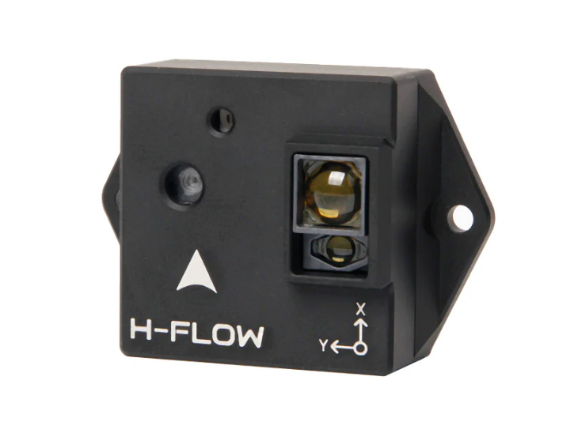
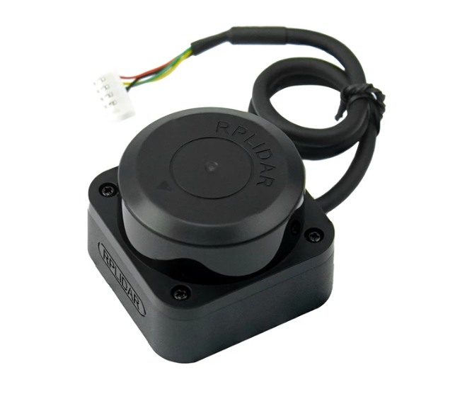

# Conceptual Design

This document outlines the objectives of a conceptual design. After reading your conceptual design, the reader should understand:

- The fully formulated problem.
- The fully decomposed conceptual solution.
- Specifications for each of the atomic pieces of the solution.
- Any additional constraints and their origins.
- How the team will accomplish their goals given the available resources.

With these guidelines, each team is expected to create a suitable document to achieve the intended objectives and effectively inform their stakeholders.

## General Requirements for the Document
- Submissions must be composed in Markdown format. Submitting PDFs or Word documents is not permitted.
- All information that is not considered common knowledge among the audience must be properly cited.
- The document should be written in the third person.
- An introduction section should be included.
- The latest fully formulated problem must be clearly articulated using explicit "shall" statements.
- A comparative analysis of potential solutions must be performed
- The document must present a comprehensive, well-specified high-level solution.
- The solution must contain a hardware block diagram.
- The solution must contain an operational flowchart.
- For every atomic subsystem, a detailed functional description, inputs, outputs, and specifications must be provided.
- The document should include an acknowledgment of ethical, professional, and standards considerations, explaining the specific constraints imposed.
- The solution must include a refined estimate of the resources needed, including: costs, allocation of responsibilities for each subsystem, and a Gantt chart.

## Introduction

The introduction is intended to reintroduce the fully formulated problem. 

## Restating the Fully Formulated Problem

The fully formulated problem is the overall objective and scope complete with the set of shall statements. This was part of the project proposal. However, it may be that the scope has changed. So, state the fully formulated problem in the introduction of the conceptual design and planning document. For each of the constraints, explain the origin of the constraint (customer specification, standards, ethical concern, broader implication concern, etc).

## Comparative Analysis of Potential Solutions

### Computing Architecture

#### Options Considered

**1. Flight Controller (FC)** [[1](#References)]
- Examples: Pixhawk 6C
- Integrated IMU, barometer, flight firmware (PX4 / ArduPilot)
- Pros: built-in stabilization, integrated sensors, fast development, reliable
- Cons: limited low-level control, less flexibility, firmware-dependent, higher cost ($80–$200)

**2. Custom Microcontroller**
- Example: STM32, Raspberry Pi
- Pros: full control, highly customizable, lightweight, very low cost ($10–$30)
- Cons: must build control + sensor fusion, high development time

**3. Flight Controller + Companion Microcontroller**
- FC → low-level control
- MCU → mission-specific tasks
- Pros: combines reliability + flexibility, supports custom processing, scalable
- Cons: added complexity, communication required, higher power, highest total cost ($100–$250)

#### Selected Architecture
Flight Controller Only

#### Justification
Given the simplified mission scope — preset waypoints in a flat-box venue — a standalone flight controller provides sufficient processing capability. Flight controller firmware natively handles stabilization, waypoint navigation, sensor integration, and obstacle avoidance responses without requiring a companion microcontroller. This reduces system complexity, weight, and cost.

---

### Flight Controller Selection

#### Options Considered

**1. Pixhawk 6C (Holybro)** [[1](#References)]
- Price: ~$180–$220 (higher-end, expanded capability)
- Processor: STM32H743
- Sensors: redundant IMUs, onboard barometer and magnetometer
- Connectivity: multiple telemetry ports, dual power inputs — higher expandability and redundancy
- Integration: easier for complex or expanding systems

**2. Pixhawk 6C Mini (Holybro)** [[2](#References)]
- Price: ~$120–$150 (cost-effective, compact design)
- Processor: STM32H743
- Sensors: redundant IMUs, onboard barometer and magnetometer (identical to 6C)
- Connectivity: reduced port availability, single power input — more constrained system design
- Integration: sufficient for fixed, well-defined systems; less flexible for future expansion

#### Selected Flight Controller
Pixhawk 6C Mini

#### Justification
- Provides identical processing and sensing performance to the Pixhawk 6C
- Meets all required connectivity needs for the system
- Reduces cost and avoids unnecessary expansion capability
- Simplifies overall system design while maintaining reliability

---

### State Estimation (Pose Estimation)

The state estimation subsystem determines the drone's orientation and relative motion during flight using the onboard sensors of the Pixhawk 6C Mini.

#### Options Considered

**IMU** [[2](#References)]
- Sensors: ICM-42688-P and BMI055 (dual accel/gyro)
- Provides angular velocity and linear acceleration used to estimate roll, pitch, and yaw
- High update rate enables real-time stabilization; dual IMUs improve reliability
- Subject to drift over time and requires vibration isolation for accurate measurements

**Magnetometer** [[2](#References)]
- Sensor: IST8310 (onboard)
- Provides heading reference to correct yaw drift from the IMU
- Improves directional stability during navigation between measurement points
- Sensitive to magnetic interference from motors, wiring, and environment

**Barometer** [[2](#References)]
- Sensor: MS5611 (onboard)
- Provides relative altitude estimation for vertical control and level transitions
- Lightweight and directly integrated with flight controller firmware
- Affected by pressure variation and airflow, limiting precision at small height changes

**Optical Flow / VIO**
- Considered as an optional addition for relative horizontal motion estimation
- Can improve short-range position hold and reduce drift during hover
- Adds additional hardware and integration complexity; performance depends on surface texture and lighting

#### Selected Configuration
- Onboard IMUs (ICM-42688-P, BMI055)
- Onboard magnetometer (IST8310)
- Onboard barometer (MS5611)

#### Justification
- Provides sufficient orientation and relative motion estimation for stable flight and control
- Fully supported by flight controller firmware with minimal additional integration
- Optical flow was evaluated for state estimation but is instead implemented as a dedicated localization sensor, covered in the Localization subsection.

---

### Localization

The localization subsystem estimates the drone's position across the horizontal plane and altitude during autonomous indoor flight to support stable hover and waypoint execution.

#### Options Considered

**1. GPS** [[3](#References)]
- Examples: Here3+, u-blox M9N
- Standard satellite-based localization
- Pros: globally accurate, well supported by ArduPilot/PX4, no additional hardware
- Cons: unreliable indoors due to signal obstruction and multipath interference

**2. Ultra-Wideband (UWB)** [[3](#References)]
- Examples: Pozyx, Marvelmind
- RF time-of-flight ranging between fixed anchors and a drone-mounted tag
- Pros: centimeter-level indoor accuracy
- Cons: requires pre-installed anchor infrastructure throughout the venue; high setup overhead and cost

**3. Optical Flow + Downward Distance Sensor** [[4](#References)]
- Example: Holybro H-Flow
- Tracks surface features beneath the drone for horizontal velocity estimation; downward distance sensor provides altitude hold
- Pros: self-contained, no external infrastructure, lightweight, low cost, native ArduPilot/PX4 support
- Cons: drift over long distances; performance dependent on surface texture and lighting

#### Selected Localization Method
Optical Flow + Downward Distance Sensor (Holybro H-Flow)

#### Justification
GPS is unsuitable for indoor use. UWB offers accuracy but requires anchor installation incompatible with live-event time constraints. Optical flow requires no external infrastructure, integrates natively with the Pixhawk 6C Mini, and provides sufficient stability for a low-speed preset waypoint mission in a flat-box venue.

---

### Obstacle Detection

The obstacle detection subsystem is responsible for identifying objects within the drone's flight path during navigation between waypoints to prevent collisions and ensure safe operation.

#### Options Considered

**1. Ultrasonic Sensors** [[5](#References)]
- Examples: HC-SR04, MaxSonar EZ series
- Emit sound pulses and measure return time to estimate distance
- Pros: very low cost, simple integration
- Cons: narrow detection cone, slow update rate, susceptible to interference from drone motor noise and acoustic reflections in venue environments

**2. Single-Point ToF Sensor** [[6](#References)]
- Examples: Benewake TFMini, VL53L1X
- Single-axis distance measurement using time-of-flight
- Pros: lightweight, inexpensive, UART/I2C compatible
- Cons: extremely narrow field of view (~2-3°); multiple units required for adequate coverage, increasing wiring complexity

**3. 2D Scanning LiDAR** [[7](#References)]
- Example: SLAMTEC RPLIDAR C1
- Rotating laser scanner providing continuous 360° horizontal distance measurements
- Pros: full horizontal coverage with no blind spots, 12m range, 5KHz sample rate, TTL UART interface, lightweight at 110g, IP54 rated
- Cons: detects obstacles only in the horizontal plane; does not cover above or below the drone

#### Selected Sensor
SLAMTEC RPLIDAR C1

#### Justification
Ultrasonic sensors are susceptible to motor noise and provide insufficient coverage. Single-point ToF sensors require multiple units for adequate coverage, adding cost and payload weight. The RPLIDAR C1 provides full 360° coverage in a single lightweight unit, interfaces directly with the Pixhawk 6C Mini via TTL UART, and comfortably meets the demands of a low-speed waypoint mission.

---

## High-Level Solution

This section presents a comprehensive, high-level solution aimed at efficiently fulfilling all specified requirements and constraints. The solution is designed to maximize stakeholder goal attainment, adhere to established constraints, minimize risks, and optimize resource utilization. Please elaborate on how your design accomplishes these objectives.

### Hardware Block Diagram

Block diagrams are an excellent way to provide an overarching understanding of a system and the relationships among its individual components. Generally, block diagrams draw from visual modeling languages like the Universal Modeling Language (UML). Each block represents a subsystem, and each connection indicates a relationship between the connected blocks. Typically, the relationship in a system diagram denotes an input-output interaction.

In the block diagram, each subsystem should be depicted by a single block. For each block, there should be a brief explanation of its functional expectations and associated constraints. Similarly, each connection should have a concise description of the relationship it represents, including the nature of the connection (such as power, analog signal, serial communication, or wireless communication) and any relevant constraints.

The end result should present a comprehensive view of a well-defined system, delegating all atomic responsibilities necessary to accomplish the project scope to their respective subsystems.

### Operational Flow Chart

Similar to a block diagram, the flow chart aims to specify the system, but from the user's point of view rather than illustrating the arrangement of each subsystem. It outlines the steps a user needs to perform to use the device and the screens/interfaces they will encounter. A diagram should be drawn to represent this process. Each step should be represented in the diagram to visually depict the sequence of actions and corresponding screens/interfaces the user will encounter while using the device.

## Atomic Subsystem Specifications

### Internal Components Subsystem

#### Connections

The Pixhawk 6C Mini flight controller serves as the central hub of the internal components subsystem, interfacing with all onboard sensors. The Holybro H-Flow optical flow and distance sensor module connects to the Pixhawk 6C Mini via the CAN1 or CAN2 port using the DroneCAN protocol, providing horizontal velocity estimation and altitude data as digital output to the flight controller. The SLAMTEC RPLIDAR C1 2D lidar connects to the Pixhawk 6C Mini via the TELEM2 port using TTL UART serial communication, providing continuous 360° obstacle distance data as digital output to the flight controller. Both sensors receive power directly through their respective connection ports on the Pixhawk 6C Mini, with the flight controller itself powered through the external components subsystem.

#### Specifications

The Pixhawk 6C Mini shall serve as the central flight controller, managing stabilization, waypoint navigation, and sensor integration.
The flight controller shall navigate to each predefined waypoint with a positional accuracy of ±0.5 meters.
The flight controller shall maintain stable hover at each measurement waypoint within the venue.
The flight controller shall execute a predefined waypoint mission without requiring manual input during flight.
The flight controller shall actively maneuver the drone to maintain a minimum safe distance of 3 meters from any detected obstacle in the horizontal plane at all times.
The H-Flow sensor shall provide continuous optical flow and altitude data to the flight controller via DroneCAN protocol.
The H-Flow sensor shall support indoor position hold without reliance on GPS.
The RPLIDAR C1 shall perform continuous 360° horizontal scanning and transmit distance data to the flight controller via TTL UART.
The RPLIDAR C1 shall detect obstacles within a minimum range of 6 meters.
The RPLIDAR C1 shall be mounted with a fixed forward reference aligned to the drone's heading axis to enable directional obstacle response.
The internal components subsystem shall have a combined weight not exceeding 200g.

#### Description

The internal components subsystem integrates the flight controller, localization sensor, and obstacle detection sensor into a unified system responsible for autonomous navigation, position estimation, and collision avoidance during the acoustic measurement mission.

The Pixhawk 6C Mini serves as the central processing unit for all flight operations. It receives sensor data from the H-Flow and RPLIDAR C1, executes the predefined waypoint mission, and manages stabilization throughout flight. Upon arriving at each waypoint, the Pixhawk holds position while the acoustic measurement subsystem captures data, then proceeds to the next waypoint.

The Holybro H-Flow module provides continuous optical flow and downward distance data to the Pixhawk via DroneCAN, enabling stable indoor position hold without GPS. The sensor tracks surface features beneath the drone to estimate horizontal velocity and uses a time-of-flight distance sensor for altitude hold.

The SLAMTEC RPLIDAR C1 performs continuous 360° horizontal scanning and transmits angle and distance data to the Pixhawk via TTL UART. The flight controller monitors incoming scan data and actively maneuvers the drone to maintain a minimum safe distance of 3 meters from any detected obstacle in any horizontal direction at all times. The RPLIDAR C1 is mounted with a fixed forward reference aligned to the drone's heading axis, allowing the flight controller to map scan angles to real-world directions for accurate directional response.

#### Functional Flowchart

#### Applicable Standards

- **FAA Part 107:** Regulates autonomous drone operation under U.S. federal law, including maximum altitude, weight limits, and operational safety requirements.

#### Implementation & Compliance

- The Pixhawk 6C Mini firmware enforces altitude and speed limits in accordance with FAA Part 107 operational requirements.
- Emergency failsafe behaviors including controlled landing and return-to-home are configured within the flight controller firmware to ensure safe operation in fault conditions.
- The RPLIDAR C1 operates within Class 1 laser safety standards, posing no risk to personnel during venue operation.

#### Design Considerations

- The RPLIDAR C1 must be mounted with a consistent forward reference relative to the drone's heading axis to ensure accurate directional obstacle response.
- Vibration isolation should be considered for the Pixhawk 6C Mini to maintain accurate IMU measurements during flight.
- The H-Flow sensor must be mounted facing downward with an unobstructed view of the floor surface to ensure reliable optical flow performance.
- Surface texture and lighting conditions within the venue may affect H-Flow performance and should be evaluated during testing.

## Ethical, Professional, and Standards Considerations

In the project proposal, each team must evaluate the broader impacts of the project on culture, society, the environment, public health, public safety, and the economy. Additionally, teams must consider relevant standards organizations that will inform the design process. A comprehensive discussion should be included on how these considerations have influenced the design. This includes detailing constraints, specifications, and practices implemented as a result, and how these address the identified considerations.

## Resources

You have already estimated the resources needed to complete the solution. Now, let's refine those estimates.

### Budget

| **Item** | **Subsystem** | **Description** | **Qty** | **Estimated Cost** |
|---|---|---|---|---|
| **Pixhawk 6C Mini (w/ PM02 V3)** | Internal Components | Central flight controller with battery regulation module | 1 | $150 |
| **Holybro H-Flow** | Internal Components | Optical flow and distance sensor for indoor positioning | 1 | $125 |
| **SLAMTEC RPLIDAR C1** | Internal Components | 360° 2D scanning lidar for obstacle detection | 1 | $69 |
| **Internal Components Total** | | | | **$344** |
| | | | | |
| **PA6-CF Filament** | Frame | Carbon fiber reinforced nylon filament for drone frame fabrication | 1 kg | $80 |
| **Frame Total** | | | | **$80** |
| | | | | |
| **Battery** | External Components | TBD | TBD | TBD |
| **Motors (4x)** | External Components | TBD | 4 | TBD |
| **ESCs (4x)** | External Components | TBD | 4 | TBD |
| **External Components Total** | | | | **TBD** |
| | | | | |
| **Microcontroller** | DSP | TBD | TBD | TBD |
| **Microphone** | DSP | TBD | TBD | TBD |
| **Pre-amp** | DSP | TBD | TBD | TBD |
| **DSP Total** | | | | **TBD** |
| | | | | |
| **Code** | Code | No hardware costs — software only | — | $0 |
| | | | | |
| **PROJECT TOTAL** | | | | **$424 + TBD** |

### Division of Labor

First, conduct a thorough analysis of the skills currently available within the team, and then compare these skills to the specific requirements of each subsystem. Based on this analysis, appoint a team member to take the specifications for each subsystem and generate a corresponding solution (i.e. detailed design). If there are more team members than subsystems, consider further subdividing the solutions into smaller tasks or components, thereby allowing each team member the opportunity to design a subsystem.

### Timeline

Revise the detailed timeline (Gantt chart) you created in the project proposal. Ensure that the timeline is optimized for detailed design. Address critical unknowns early and determine if a prototype needs to be constructed before the final build to validate a subsystem. Additionally, if subsystem $A$ imposes constraints on subsystem $B$, generally, subsystem $A$ should be designed first.

## References

[1] Holybro. "Pixhawk 6C." Holybro, 2024. [Online]. Available: https://holybro.com/collections/flight-controllers/products/pixhawk-6c

[2] Holybro. "Pixhawk 6C Mini." Holybro, 2024. [Online]. Available: https://holybro.com/collections/flight-controllers/products/pixhawk-6c-mini

[3] NeedCode. "UWB vs GPS: When Ultra-Wideband Technology is the Superior Tracking Option." NeedCode, 2024. [Online]. Available: https://needcode.io/uwb-vs-gps-when-ultra-wideband-technology-is-the-superior-tracking-option/

[4] Holybro. "H-Flow Optical Flow and Distance Sensor Module." Holybro, 2024. [Online]. Available: https://holybro.com/products/h-flow

[5] Matha Electronics. "What is Ultrasonic Sensor? How to Use Ultrasonic Sensor?" Matha Electronics, 2022. [Online]. Available: https://www.mathaelectronics.com/a-brief-introduction-on-ultrasonic-sensorworkingapplications/

[6] Meskernel. "LiDAR Sensor vs Distance Sensor: Key Differences & Best Uses." Meskernel, 2024. [Online]. Available: https://meskernel.net/en/lidar-sensor-vs-distance-sensor/

[7] SLAMTEC. "RPLIDAR C1 – Fusion DTOF Laser Scanner." SLAMTEC, 2024. [Online]. Available: https://www.slamtec.com/en/c1

## Statement of Contributions

Each team member is required to make a meaningful contribution to the project proposal. In this section, each team member is required to document their individual contributions to the report. One team member may not record another member's contributions on their behalf. By submitting, the team certifies that each member's statement of contributions is accurate.

