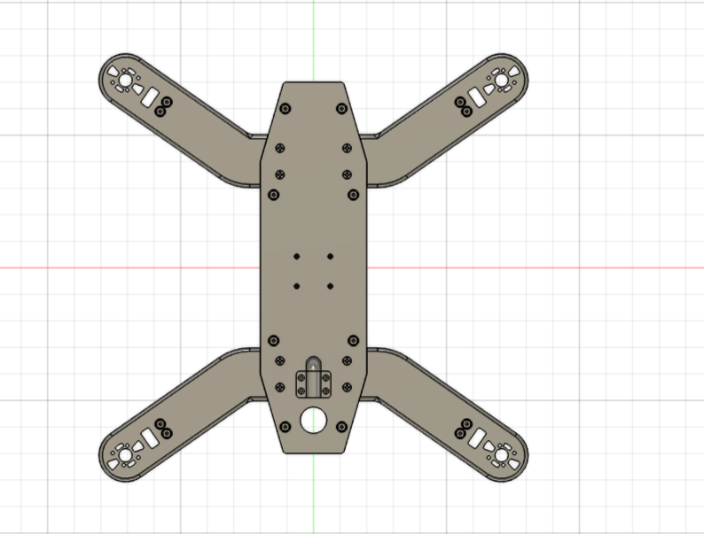
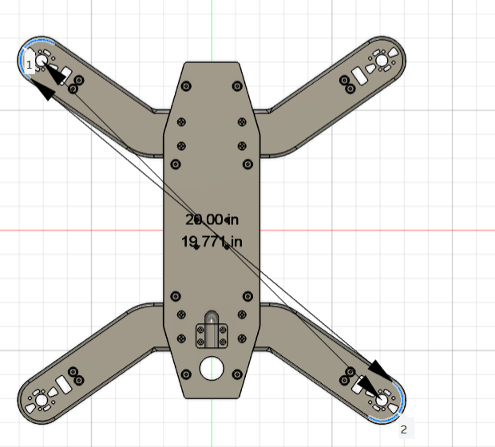
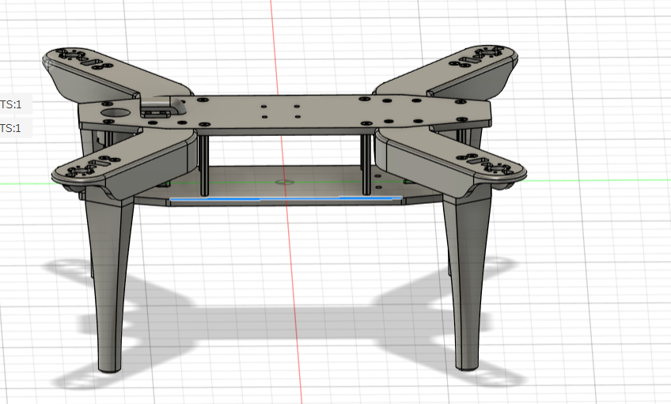
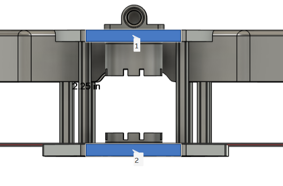
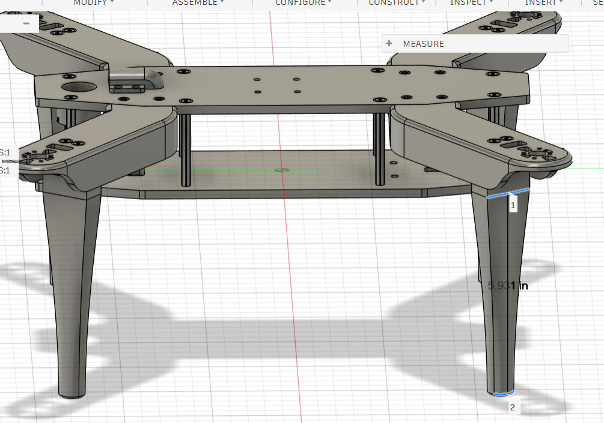
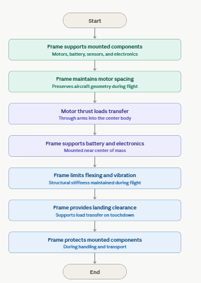

# Detailed Design
## Frame Subsystem Detailed Design

### Function of the Subsystem

&nbsp; &nbsp; &nbsp; &nbsp; The frame subsystem provides the primary mechanical structure for the autonomous acoustic measurement drone. Its purpose is to support the propulsion system, power system, flight controller, sensing hardware, onboard processing hardware, and wiring while maintaining the geometry required for stable multirotor flight.

&nbsp; &nbsp; &nbsp; &nbsp; The frame also supports the acoustic measurement mission by providing a stable mounting platform for sensors and electronics. Since the drone is intended to collect acoustic data, the frame must minimize unnecessary vibration, maintain component alignment, and provide enough mounting space for the battery, flight controller, sensors, and wiring.

---

### Specifications and Constraints

The frame subsystem shall satisfy the following dimensional specifications:

| Parameter | Value |
|---|---:|
| Frame configuration | H-frame |
| Overall frame size | 14.142 in × 14.142 in |
| Motor-to-motor diagonal | 20.000 in |
| Center body plate area | Approximately 14.000 in × 4.000 in |
| Arm length | Approximately 5.898 in |
| Top-to-bottom spacing | 2.250 in |
| Primary material | Carbon fiber or carbon-fiber-reinforced material |
| Secondary/custom mount material | PETG or carbon-fiber-reinforced nylon |
| Target frame mass | Approximately 500 g |
| Supported total aircraft mass | Approximately 2.2–2.3 kg |

#### Constraints

- The frame shall be lightweight to reduce propulsion power demand and improve flight time.
- The frame shall be rigid enough to prevent excessive flexing during takeoff, hover, maneuvering, and landing.
- The frame shall provide sufficient mounting space for the battery, flight controller, acoustic sensing hardware, and wiring.
- The frame shall maintain motor alignment to support stable thrust generation.
- The frame shall include sufficient clearance for propeller rotation.
- The frame shall support safe handling, transport, takeoff, and landing.
- The frame shall include protective spacing between the ground and underside components through the 2.25 in top-to-bottom spacing.
- The frame shall support safe operation by reducing the risk of loose components, sharp edges, and structural failure.

---

### Overview of Proposed Solution

&nbsp; &nbsp; &nbsp; &nbsp; The proposed frame design is an H-frame structure with four arms extending from a long central body plate. The selected layout has an overall square footprint of approximately 14.142 in × 14.142 in and a motor-to-motor diagonal of 20.000 in. This geometry provides a compact but stable layout for the selected propulsion system.

&nbsp; &nbsp; &nbsp; &nbsp; The central body plate is approximately 14.000 in long and 4.000 in wide. This provides enough mounting area for the battery, flight controller, onboard electronics, and sensor hardware while keeping the design narrow enough to reduce unnecessary weight. Each arm is approximately 5.898 in long from the central body transition to the motor mount region.

&nbsp; &nbsp; &nbsp; &nbsp; The design uses a stacked frame arrangement with a top-to-bottom height of approximately 2.250 in. This vertical spacing provides room for hardware mounting, wiring clearance, and limited impact protection during landing.

---

### Interface with Other Subsystems

#### Interface with Power and Propulsion Subsystem

| Interface Item | Description |
|---|---|
| Interface type | Mechanical support and electrical routing |
| Connected components | Motors, ESCs, propellers, battery |
| Signal/power type | DC power wiring and motor control wiring routed through or along the frame |
| Direction | Frame provides mechanical output/support to propulsion components; propulsion loads are transferred back into the frame |
| Data/protocol | No communication protocol is used by the frame itself |

The frame provides mounting holes and arm geometry for the motors. The arms maintain motor spacing and alignment so that thrust is distributed symmetrically around the aircraft. The center body provides mounting area for the battery and supports routing from the battery to the ESCs.

#### Interface with Flight Control Subsystem

| Interface Item | Description |
|---|---|
| Interface type | Mechanical mounting and vibration control |
| Connected components | Flight controller, IMU, wiring |
| Signal type | Digital control and sensor signals routed through mounted electronics |
| Direction | Frame supports the flight controller; vibration from the frame may affect IMU readings |
| Data/protocol | No direct frame protocol; flight controller may use PWM, UART, I2C, or CAN depending on connected devices |

The frame provides a central mounting location for the flight controller. The flight controller should be mounted near the center of the frame to reduce vibration and improve estimation of aircraft motion.

#### Interface with Sensing and Acoustic Measurement Subsystem

| Interface Item | Description |
|---|---|
| Interface type | Mechanical support and vibration isolation |
| Connected components | Microphone, acoustic sensor mounts, navigation sensors |
| Signal type | Analog audio and digital sensor data carried by sensing hardware |
| Direction | Frame provides mechanical support; sensing subsystem receives stability benefit from frame rigidity |
| Data/protocol | No direct frame protocol; sensors may use analog audio, USB, I2C, UART, or other subsystem-specific interfaces |

The frame supports the acoustic sensor hardware and must minimize vibration transfer to the microphone. Sensor mounts may use PETG or carbon-fiber-reinforced nylon brackets with damping material if needed.

#### Interface with Landing and Protection Features

| Interface Item | Description |
|---|---|
| Interface type | Mechanical support |
| Connected components | Landing feet, skids, dampers, protective mounts |
| Signal type | None |
| Direction | Frame transfers landing loads from feet/skids into the main body |
| Data/protocol | None |

The 2.25 in top-to-bottom spacing allows the frame to support landing clearance. Landing features should protect the battery, electronics, and sensor hardware from ground contact.

---

### 3D Model of Custom Mechanical Components

&nbsp; &nbsp; &nbsp; &nbsp; The frame was modeled as an H-frame with a long central body plate and four angled arms. The design includes motor mounting regions at the end of each arm, fastener holes along the center plate, and internal spacing for stacked components.

The frame model includes the following measured features:

- Overall square footprint: **14.142 in × 14.142 in**
- Motor-to-motor diagonal: **20.000 in**
- Center body plate: **approximately 14.000 in × 4.000 in**
- Arm length: **approximately 5.898 in**
- Top-to-bottom spacing: **2.250 in**

![Frame top view]
**Figure 1.** Top view of the H-frame drone body showing the overall frame layout and motor locations.


**Figure 2.** Diagonal motor-to-motor distance of 20.000 in.


**Figure 3.** Side view of the frame.



**Figure 4.** Side view of the frame showing the 2.250 in top-to-bottom spacing.


**Figure 5.** Landing gear of the drone, 5.931 inch in lenght.


# Buildable Mechanical Diagram — H-Frame Drone Subsystem

## Frame Dimensions

| Feature | Dimension |
|---|---|
| Overall width | 14.142 in |
| Overall height | 14.142 in |
| Diagonal motor-to-motor distance | 20.000 in |
| Center body plate length | 14.000 in |
| Center body plate width | 4.000 in |
| Approximate arm length | 5.898 in |
| Vertical spacing | 2.250 in |

## Assembly Notes

- Mount the four motors at the motor mounting holes located at the end of each arm.
- Mount the flight controller near the geometric center of the frame.
- Mount the battery along the center body plate to maintain center-of-mass balance.
- Route battery and ESC wiring along the frame body and arms.
- Mount acoustic sensing hardware on an isolated bracket to reduce vibration transfer.
- Verify that all propeller zones are clear before operation.
- Inspect all screws, standoffs, and mounts before flight.

---

## Functional Operation

During operation, the frame acts as a passive structural subsystem. It does not process data or communicate electronically, but it directly affects the performance of the aircraft by supporting all components, maintaining alignment, and transferring loads.

During takeoff and flight, motor thrust loads are transferred from each motor mount through the arms and into the center body. The center body supports the battery and electronics near the aircraft center of mass. During landing, impact loads are transferred from the landing points into the frame structure.

## Functional Flowchart

```


---

## Bill of Materials

| Item | Description | Manufacturer / Source | Quantity | Est. Unit Price | Est. Total | Purchasing URL |
|---|---|---|---|---|---|---|
| Carbon fiber plate/sheet | Main body plates and arms, approx. 3 mm carbon fiber sheet | Generic carbon fiber sheet supplier | 1–2 sheets | $30–$80 | $30–$160 | [See supplier [1]](https://www.amazon.com/COYOUCO-Carbon-Fiber-Surface-Sheets/dp/B0DLB6F3Z6) |
| M3 aluminum standoffs | Frame spacing and stacked assembly support | FPV hardware supplier | 1 kit | $3–$15 | $3–$15 | [See supplier [2],[3]](https://www.myfpvstore.com/extras-and-hardware/impulserc-m3-standoff-pick-your-length/) |
| M3 screws/nuts/washers | Mechanical fastening hardware | Generic / FPV hardware supplier | 1 kit | $8–$15 | $8–$15 | [See supplier [3]](https://pyrodrone.com/collections/m3) |
| PETG or PETG-CF filament | Prototype sensor mounts and brackets | SUNLU / filament supplier | 1 kg | ~$20–$30 | ~$20–$30 | [See supplier [4]](https://store.sunlu.com/products/petg-cfpetg-carbon-fiber-3d-printer-filament-1kg) |
| Carbon-fiber nylon filament | Final rigid sensor mounts, if used | MatterHackers NylonX or equivalent | 0.5 kg | ~$60–$70 | ~$60–$70 | [See supplier [5]](https://www.matterhackers.com/store/3d-printer-filament/nylonx-carbon-fiber-nylon-filament-1.75mm) |
| Landing feet/skids | Rubber/TPU/printed landing protection | Custom printed / generic | 4 | $2–$5 | $8–$20 | Custom or generic |

**Estimated frame subsystem total:**
- Minimum estimated cost: ~$69
- Higher-performance estimate (with carbon-fiber nylon mounts): ~$250–$300

---

## Analysis of Crucial Design Decisions

### H-Frame Selection
The H-frame was selected because it provides a long central body plate and sufficient mounting room for the battery, flight controller, and acoustic measurement hardware. Compared to a compact X-frame, the H-frame offers better packaging flexibility and easier access to mounted components.

### Size Selection
The measured frame footprint of 14.142 in × 14.142 in with a 20.000 in motor-to-motor diagonal provides enough physical space for the selected 13 in propellers while keeping the frame compact. This helps reduce weight and improves flight efficiency.

### Center Plate Design
The approximately 14 in × 4 in central body plate gives the frame enough length for battery placement and electronics mounting while limiting excess material. The narrow center body supports the goal of reducing weight while maintaining adequate usable mounting area.

### Arm Length
The approximately 5.898 in arm length keeps the motor mounts far enough from the center body to provide propeller clearance while avoiding unnecessary extra material. Shorter arms reduce frame mass and may improve arm stiffness.

### Vertical Spacing
The 2.250 in top-to-bottom spacing provides clearance for electronics, wiring, and landing protection. This spacing also helps protect the lower-mounted components during touchdown.

### Material Selection
Carbon fiber or carbon-fiber-reinforced material is used because it provides high stiffness at low mass. This is important because the aircraft must carry sensors, battery mass, and propulsion hardware while maintaining reasonable flight time.

---

## Detailed Shall Statements

### Functional Requirements
1. The frame subsystem shall support all propulsion, power, control, sensing, and communication components.
2. The frame subsystem shall maintain a stable H-frame geometry during takeoff, hover, autonomous flight, and landing.
3. The frame subsystem shall provide a central mounting area for the battery, flight controller, and onboard electronics.
4. The frame subsystem shall support the acoustic sensing hardware without interfering with propeller operation.

### Dimensional Requirements
1. The frame subsystem shall have an overall footprint of approximately 14.142 in × 14.142 in.
2. The frame subsystem shall have a motor-to-motor diagonal distance of approximately 20.000 in.
3. The frame subsystem shall include a center body plate area of approximately 14.000 in × 4.000 in.
4. The frame subsystem shall use arms approximately 5.898 in long from the center body transition to the motor mounting region.
5. The frame subsystem shall provide approximately 2.250 in of top-to-bottom spacing.

### Mechanical Requirements
1. The frame subsystem shall maintain sufficient stiffness to prevent excessive arm deflection during flight.
2. The frame subsystem shall support a total aircraft mass of at least 2.3 kg.
3. The frame subsystem shall provide secure mounting holes for four motors.
4. The frame subsystem shall provide mounting points for standoffs, landing supports, and component brackets.
5. The frame subsystem shall provide adequate clearance for propeller rotation.

### Weight Requirements
1. The frame subsystem shall minimize mass to reduce battery power consumption.
2. The frame subsystem shall target a frame mass near 500 g.
3. The frame subsystem shall avoid unnecessary material in non-load-bearing areas.

### Integration Requirements
1. The frame subsystem shall allow the battery to be mounted near the aircraft center of mass.
2. The frame subsystem shall allow the flight controller to be mounted near the geometric center of the aircraft.
3. The frame subsystem shall provide routing paths for motor, ESC, battery, and sensor wiring.
4. The frame subsystem shall support removable or replaceable sensor mounts.
5. The frame subsystem shall allow access to screws, standoffs, and electronics for maintenance.

### Safety and Validation Requirements
1. The frame subsystem shall be inspected before each flight for loose screws, cracks, or damaged mounting points.
2. The frame subsystem shall be validated through a static load test before flight.
3. The frame subsystem shall be validated through hover testing to observe vibration, flexing, and stability.
4. The frame subsystem shall prevent mounted components from contacting the ground during normal landing.
5. The frame subsystem shall avoid sharp exposed edges that could injure users during handling.

---

## References

[1] COYOUCO, "Carbon Fiber Sheet, 400 × 500 mm," Amazon. [Online]. Available: https://www.amazon.com/COYOUCO-Ctandoff, Pick Your Length," MyFPVStore. [Online]. Available: https://www.myfpvstore.com/exarbon-Fiber-Surface-Sheets/dp/B0DLB6F3Z6

[2] ImpulseRC, "M3 Stras-and-hardware/impulserc-m3-standoff-pick-your-length/

[3] PyroDrone, "M3 Hardware for FPV Racing & Freestyle Drones," PyroDrone. [Online]. Available: https://pyrodrone.com/collections/m3

[4] SUNLU, "PETG-CF 3D Printer Filament 1 kg," SUNLU Store. [Online]. Available: https://store.sunlu.com/products/petg-cfpetg-carbon-fiber-3d-printer-filament-1kg

[5] MatterHackers, "NylonX Carbon Fiber Nylon Filament," MatterHackers. [Online]. Available: https://www.matterhackers.com/store/3d-printer-filament/nylonx-carbon-fiber-nylon-filament-1.75mm