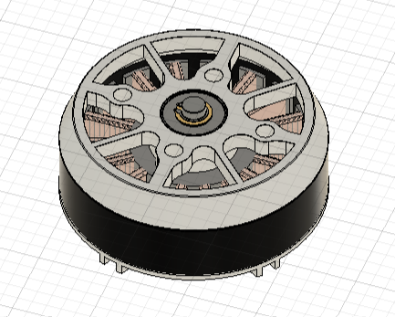
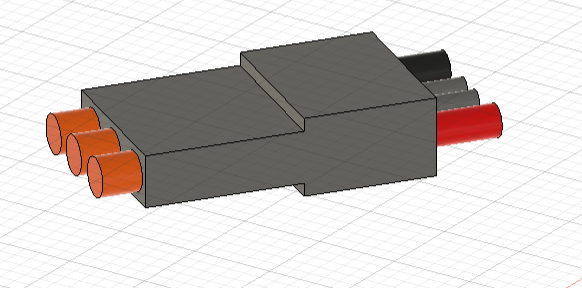
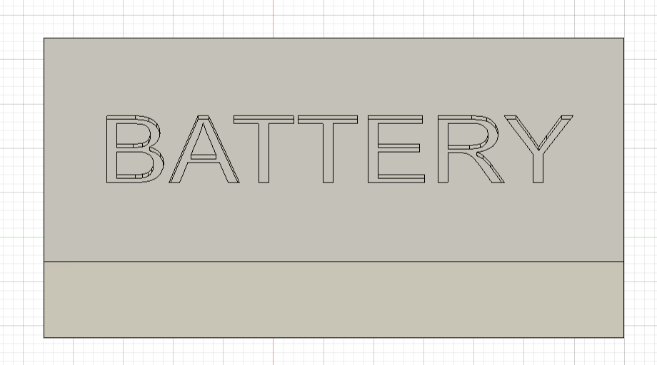
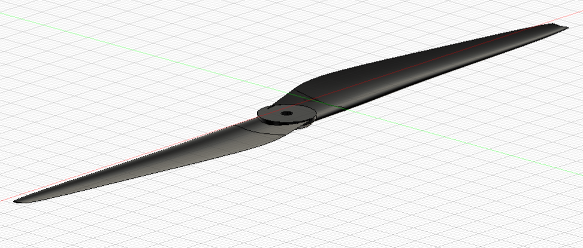
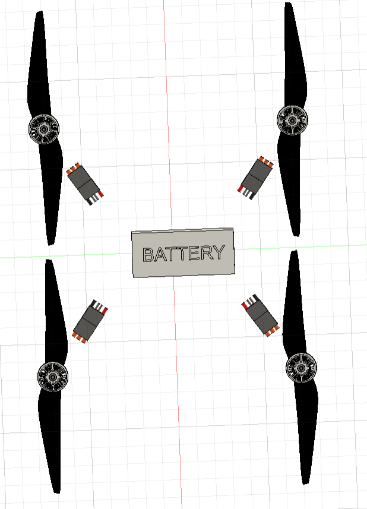
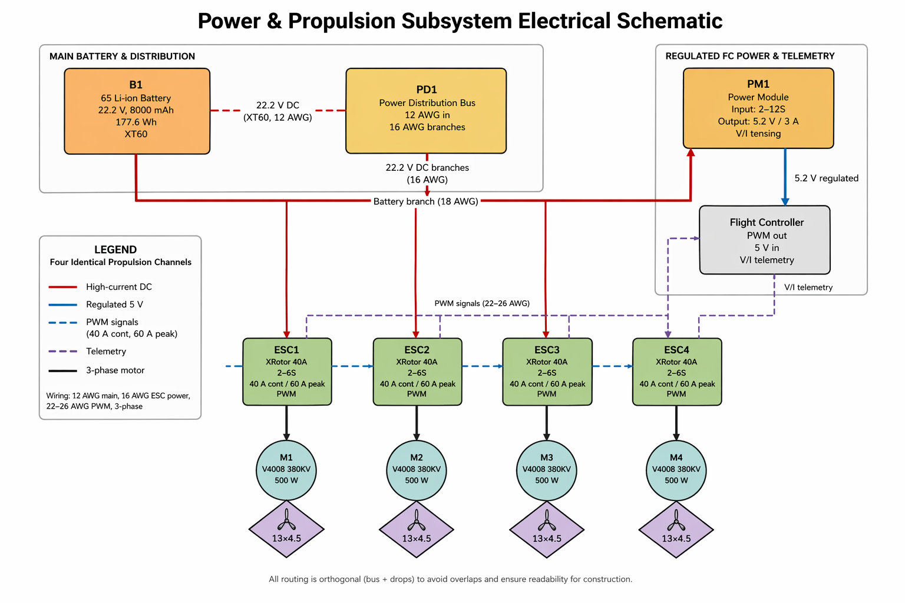

# Detailed Design

This document outlines the objectives of a comprehensive system design. After reviewing this material, the reader should clearly understand:

- How the subsystem integrates within the overall system  
- The constraints and specifications that define its operation  
- The reasoning behind key design decisions  
- The process required to construct and implement the subsystem  

## General Requirements for the Document

The document should include:

- A clear explanation of how the subsystem integrates into the overall solution  
- Detailed specifications and constraints specific to the subsystem  
- A concise overview of the proposed solution  
- Defined interfaces with other subsystems  
- 3D models of any custom mechanical elements*  
- A buildable schematic diagram*  
- A Printed Circuit Board (PCB) layout, if applicable*  
- An operational flowchart*  
- A complete Bill of Materials (BOM)  
- Analysis supporting major design decisions  

\*Note: These elements are only required when relevant to the subsystem.

---

## Function of the Subsystem

The power and propulsion subsystem is responsible for storing electrical energy, distributing that energy to both propulsion and control components, and generating the thrust required for takeoff, hovering, maneuvering, and landing.

This subsystem includes:

- 6S Li-Ion battery (22.2 V, 177.6 Wh)  
- Power module (regulated 5.2 V output)  
- Four ESCs (40 A continuous)  
- Four brushless motors (380 KV, 500 W max)  
- Four propellers (13×4.5 in)  

The battery supplies high-current DC power to the ESCs and regulated power to the flight controller through the power module. The ESCs convert this DC power into three-phase AC signals that drive the motors. The motors then convert electrical energy into rotational motion, which the propellers translate into thrust.

Overall, the subsystem ensures stable and efficient autonomous flight by maintaining sufficient thrust, proper power regulation, and balanced weight distribution.

---

## Specifications and Constraints

### Specifications

- **Battery voltage:** 22.2 V nominal  
- **Battery capacity:** 8000 mAh  
- **Battery energy:** 177.6 Wh  
- **Usable energy:** 142–151 Wh  

- **Motor KV:** 380 KV  
- **Motor max power:** 500 W  
- **Motor quantity:** 4  

- **ESC rating:** 40 A continuous, 60 A peak  
- **ESC quantity:** 4  

- **Propeller size:** 13×4.5 in  

- **Estimated aircraft mass:**  
  - Propulsion mass: 1460.4 g  
  - Non-propulsion mass: 1160 g  
  - Total mass: ~2620 g (2.62 kg)  

### Thrust Requirements

- **Required hover thrust:**
  - Total: ~2620 gf (25.70 N)
  - Per motor: ~655 gf (6.43 N)

- **Estimated max thrust per motor:** ~1600 g
- **Estimated total max thrust:** ~6400 g

- **Thrust-to-weight ratio:**
  - ~2.4 : 1

The maximum thrust estimate is based on APC 13×4.5MR propeller performance data and the operating capabilities of the selected SunnySky V4008 380KV motor. The actual maximum thrust will depend on the motor's achievable RPM, battery voltage, and electrical loading.

### Torque

- **Estimated motor shaft torque:**
  - ~0.09 N·m at hover
  - ~0.26 N·m at the estimated maximum operating point

- **Control torque about CG:**
  - Dependent on final motor spacing and thrust differential
  - To be calculated using the final frame geometry

### Power Consumption

- **Estimated hover propulsion power:** ~210–250 W
- **Estimated total average flight power:** 450–600 W

The hover propulsion estimate is based on APC propeller performance data and an assumed motor efficiency of approximately 80–85%. The higher total flight power allowance accounts for maneuvering, electrical losses, onboard electronics, and the acoustic measurement payload. 

### Flight Time

- **At 450 W:** ~18–20 min  
- **At 525 W:** ~16–17 min  
- **At 600 W:** ~14–15 min  

- **Realistic mission estimate:**  
  - **16–17 minutes**

### Constraints

The subsystem operates under several important constraints that stem from physical limitations, component capabilities, and integration requirements. These constraints guide design decisions and ensure safe, reliable operation.

#### **Electrical Voltage Constraint**  
All components must operate within a 6S voltage architecture (nominal 22.2 V, maximum ~25.2 V fully charged). This ensures compatibility across the system and prevents damage due to overvoltage conditions.

#### **Current Constraint**  
The ESCs are rated at 40 A continuous and 60 A peak. The system must remain within these limits during all operating conditions. Exceeding these ratings can lead to overheating, component failure, or wiring damage. This constraint also influences wire selection and cooling considerations.

#### **Wire Gauge and Connector Constraint**
The main power distribution wiring and ESC branches must be sized for their expected current, voltage drop, and thermal loading. A preliminary selection of 10 AWG main wiring and 14 AWG extended ESC branches is based on a conservative 80 A combined current and 20 A per-motor design case. Connector ratings must also be verified independently, since a wire's current capability does not establish the rating of the connector attached to it.

#### **Thrust-to-Weight Constraint**  
A thrust-to-weight ratio greater than 2:1 is required for stable flight and control authority. This requirement drove the selection of low-KV motors and larger propellers to maximize efficiency while supporting system mass.

#### **Energy and Endurance Constraint**  
Flight time is limited by battery capacity (177.6 Wh) and average power consumption (450–600 W). Only 80–85% of battery capacity is usable, resulting in 142–151 Wh available for operation. This directly limits flight time to approximately 16–20 minutes.

#### **Mechanical Constraint**
All components must fit within the final H-frame geometry while maintaining safe propeller spacing and proper center-of-gravity placement. The selected 13-inch propellers require sufficient motor-center spacing to prevent overlap between adjacent swept disks. The nominal 16 in × 16 in frame dimensions do not independently establish the available propeller clearance, so the final motor-center coordinates must be checked in CAD. The frame geometry will be adjusted as necessary to accommodate the selected propellers and the estimated 2.62 kg aircraft mass.

#### **Power Regulation Constraint**  
The flight controller requires a regulated 5 V supply and cannot be powered directly from the battery. A power module is therefore necessary to provide stable voltage under varying loads.

#### **Safety Constraint**  
Voltage and current monitoring must be included to enable failsafe behavior. Components must also be properly rated to prevent overheating, short circuits, or electrical failure.

#### **Socio-Economic Constraint**  
The design prioritizes cost-effective, commercially available components. This ensures affordability, ease of procurement, and long-term maintainability.

These constraints collectively define the design space and ensure that the subsystem remains safe, efficient, and practical.

---

## Overview of Proposed Solution

The subsystem uses a dual-path power architecture:

### High-Power Path
Battery → Power distribution → ESCs → Motors → Propellers  

### Low-Power Path
Battery → Power module → Flight controller  

This architecture provides:

- Efficient power delivery to propulsion components  
- Safe voltage regulation for avionics  
- Minimal electrical interference  
- Adequate thrust for system mass  

The system is optimized for stable hovering and efficient lift generation.

---

## Interface with Other Subsystems

| Interface | Signal Type | Direction | Method | Data / Function |
|----------|------------|----------|--------|----------------|
| Battery → ESCs | Electrical (DC) | Output | Power distribution | High-current propulsion power |
| Battery → Power Module | Electrical (DC) | Output | Direct wiring | Battery input for regulation |
| Power Module → Flight Controller | Electrical (DC) | Output | 5V regulated | Power supply |
| Power Module → Flight Controller | Analog | Output | ADC sensing | Voltage and current telemetry |
| Flight Controller → ESCs | Digital | Output | PWM | Motor speed control |
| ESCs → Motors | Electrical (3-phase) | Output | Direct wiring | Motor drive |
| Motors → Propellers | Mechanical | Output | Shaft coupling | Thrust generation |
| Power & Propulsion → Frame | Mechanical / Structural | Bidirectional | Mounting hardware | Structural support |

All interfaces are designed to ensure reliable operation, safe power distribution, and minimal interference.

---

## 3D Model of Custom Mechanical Components

The following models represent the major power and propulsion components used in the subsystem. These models are intended to show component placement, spacing, and general fit within the drone frame rather than internal electrical or mechanical construction. Dimensions were based on available component specifications and simplified where appropriate for clean CAD integration.

---

### Motor Model — SunnySky V4008 380KV

The motor model represents the SunnySky V4008 380KV brushless motor used at each arm end. The model includes the outer cylindrical motor body, top rotor detail, shaft region, and mounting base. For frame integration, the most important dimensions are the rotor diameter, body length, mounting area, and clearance around the propeller hub.

Relevant dimensions and specifications:

- Rotor diameter: **44.3 mm**
- Stator diameter: **40 mm**
- Body length: **20 mm**
- Stator thickness: **8 mm**
- Weight: **105 g**
- KV rating: **380KV**
- Maximum continuous power: **500 W**
- Maximum continuous current: **20 A**
- Recommended ESC: **30–40 A**
- Recommended single takeoff weight: **≤1000 g per motor**  
- Recommended propeller range includes **12–17 inch propellers** :contentReference[oaicite:0]{index=0}

This model is used to verify that the motors can be mounted symmetrically at the arm ends and that each motor has enough clearance for the selected 13-inch propellers.

### ESC Model — HobbyWing XRotor 40A ESC

The ESC model represents one of the four individual ESCs mounted along the frame arms. The model includes the rectangular ESC body and wire bundles entering and leaving the component. Each ESC receives high-current DC power from the power distribution system, receives a PWM control signal from the flight controller, and outputs three-phase motor drive signals to the motor.

Relevant dimensions and specifications:

- Continuous current rating: **40 A**
- Peak current rating: **60 A**
- Input voltage range: **2S–6S**
- BEC: **None**
- Weight: **26 g**
- Dimensions: **68 mm × 25 mm × 8.7 mm**

### Battery Model — iFlight Fullsend 6S 8000mAh Li-Ion Battery

The battery model represents the main onboard energy source. Since the battery is the heaviest component in the power and propulsion subsystem, its placement is critical for maintaining the drone’s center of gravity. The battery should be mounted near the center of the frame and secured with a strap or mechanical retention bracket.

Relevant dimensions and specifications:

- Voltage: **22.2 V nominal**
- Capacity: **8000 mAh**
- Energy: **177.6 Wh**
- Cell configuration: **6S2P**
- Size: **42 mm × 64 mm × 147 mm**
- Weight: **840 g**
- Discharge rating: **17.5C**
- Main connector: **XT60**

The battery model is simplified as a rectangular body with a visible label. This is sufficient for checking fit, mounting space, and center-of-gravity placement.

### Propeller Model — APC 13×4.5MR

The propeller model represents the selected APC 13×4.5 multirotor propellers. The model includes the hub and blade geometry needed to visualize clearance between adjacent propeller disks. Propeller clearance is one of the most important checks in the frame layout because each propeller sweeps a circular area equal to its diameter.

Relevant dimensions and specifications:

- Diameter: **13 in / 330 mm**
- Pitch: **4.5 in**
- Hub diameter: **0.65 in**
- Hub thickness: **0.36 in**
- Shaft diameter: **1/4 in**
- Weight: **0.85 oz / 24.1 g**

The propeller model is used to verify that the selected frame geometry provides enough spacing between propeller swept areas.

### Full Power and Propulsion Layout

The full layout shows the relative placement of the battery, ESCs, motors, and propellers. The battery is positioned near the center of the aircraft to reduce center-of-gravity offset. The ESCs are distributed near the arms to improve cooling and shorten motor wiring. The motors and propellers are placed symmetrically to maintain balanced thrust and predictable control response.

This layout supports the intended design because:

- the battery is centered to reduce imbalance
- ESCs are placed near the motors for shorter three-phase wiring
- motors are evenly spaced for symmetric thrust
- propellers are shown with enough spacing to evaluate clearance
- the arrangement reflects the physical wiring path of the subsystem

---

## Buildable Schematic 

---

## Printed Circuit Board Layout

A custom PCB is not required for this subsystem. All components are commercially available and designed to be interconnected using standard wiring. The ESCs and power module already include the necessary internal circuitry.

---

## Flowchart

A flowchart is not required since this subsystem does not include custom software or decision-making logic. Control is handled by the flight controller in a separate subsystem.

---

## BOM

| Ref | Component | Manufacturer | Part Number | Distributor | Distributor Part | Qty | Unit Price ($) | Total ($) | URL |
|-----|----------|-------------|-------------|-------------|------------------|-----|----------------|-----------|-----|
| B1 | Battery | iFlight | Fullsend 6S 8000mAh | iFlight | Pro1914 | 1 | 83.99 | 83.99 | https://shop.iflight.com/Fullsend-6S-8000mAh-Li-Ion-Battery-Pro1914 |
| M1–M4 | Brushless Motor | SunnySky | V4008 380KV | SunnySky USA | V4008 | 4 | 54.99 | 219.96 | https://sunnyskyusa.com/products/sunnysky-v4008-motors |
| ESC1–ESC4 | ESC | HobbyWing | XRotor 40A | HobbyWing Direct | XRotor-40A | 4 | 17.99 | 71.96 | https://www.hobbywingdirect.com/products/xrotor-40a-esc |
| P1–P4 | Propellers | APC | 13×4.5MR-B4 | APC | MR-B4 | 1 set | 16.87 | 16.87 | https://www.apcprop.com/product/13x4-5mr/ |
| CONN1 | Battery Connectors | Amass | XT60 Pair | Amazon | XT60 Set | 2 | 1.90 | 3.80 | — |
| WIRE1 | Power Wiring | BNTECHGO | 12–16 AWG Silicone Wire | Amazon | Wire Kit | 1 | ~15.00 | ~15.00 | — |
| HS1 | Heat Shrink | Eventronic | Heat Shrink Kit | Amazon | HS-Kit | 1 | ~10.00 | ~10.00 | — |
| MISC | Mounting Hardware | Generic | — | Amazon | Assorted Kit | — | ~15.00 | ~15.00 | — |

### **Total Cost: $461.57**

---

## Analysis

The power and propulsion subsystem is designed to provide reliable energy delivery, efficient thrust generation, and stable flight performance for the autonomous drone. The selected design uses a 6S Li-Ion battery, a regulated power module, four individual ESCs, four low-KV brushless motors, and four 13×4.5 propellers. This configuration is appropriate for the mission because it emphasizes stable hover, efficient lift, and dependable operation rather than high-speed or aggressive flight.

### Thrust, Power, and Torque Analysis

The estimated aircraft mass is approximately **2.62 kg**. For a quadcopter, the minimum hover thrust must equal the aircraft weight. Therefore:

T_hover = mg

T_hover = 2.62 kg × 9.81 m/s² = 25.70 N

T_hover,motor = 25.70 N / 4 = 6.43 N ≈ 655 gf

Each motor must therefore produce approximately **655 g of thrust** to maintain hover.

The selected APC 13×4.5MR propeller has published performance data that provides calculated thrust, shaft power, and torque at different rotational speeds. APC generates this data using its proprietary aerodynamic analysis software and actual propeller geometry. The following values represent static operating conditions and provide a basis for estimating the performance of the selected motor and propeller combination. [13]

| Propeller RPM | Static Thrust (N) | Static Thrust (gf) | Shaft Power (W) | Shaft Torque (N·m) |
|---------------|-------------------|-------------------|-----------------|--------------------|
| 3000 | 2.878 | 293 | 15.8 | 0.050 |
| 4000 | 5.132 | 523 | 36.5 | 0.087 |
| 5000 | 8.046 | 820 | 70.1 | 0.134 |
| 6000 | 11.633 | 1186 | 119.8 | 0.191 |
| 7000 | 15.909 | 1622 | 189.0 | 0.258 |

The required hover thrust of 6.43 N falls between the 4000 and 5000 RPM operating points. Linear interpolation provides an approximate hover speed:

f = (6.43 − 5.132) / (8.046 − 5.132) = 0.445

RPM_hover ≈ 4000 + 0.445(5000 − 4000)

RPM_hover ≈ 4445 RPM

The corresponding shaft power is:

P_shaft,hover ≈ 36.5 + 0.445(70.1 − 36.5)

P_shaft,hover ≈ 51.5 W per motor

For four motors:

P_shaft,total ≈ 4 × 51.5 = 206 W

Electrical input power is greater than shaft power because of motor and ESC losses. Assuming a combined motor and ESC efficiency of approximately 80–85%:

P_electrical,hover = P_shaft,total / η

At 80% efficiency:

P_electrical,hover ≈ 206 / 0.80 = 258 W

At 85% efficiency:

P_electrical,hover ≈ 206 / 0.85 = 242 W

The estimated hover propulsion power is therefore approximately **240–260 W**. This is a preliminary estimate based on APC aerodynamic data and assumed electrical efficiency. It does not include the power consumed by the flight controller, sensors, DSP, wireless equipment, or other onboard electronics.

The APC data also provides a direct estimate of motor shaft torque. At the interpolated hover operating point:

τ_hover ≈ 0.087 + 0.445(0.134 − 0.087)

τ_hover ≈ 0.108 N·m

At 7000 RPM, the APC data gives a shaft torque of approximately 0.258 N·m and a static thrust of 15.909 N. This corresponds to approximately 1622 gf of thrust per motor.

The estimated thrust-to-weight ratio at this operating point is therefore:

T/W = (4 × 1622) / 2620 ≈ 2.48 : 1

This supports the preliminary design target of approximately **2.4:1**. However, the APC data describes the propeller's aerodynamic loading rather than a complete motor-propeller test. The final achievable RPM must also satisfy the SunnySky motor's voltage, current, power, and thermal limits. The maximum thrust estimate is therefore considered a design prediction rather than a guaranteed operating value.

The selected 380KV motors are appropriate because their low-KV design is better suited to driving larger propellers at lower rotational speeds than a high-KV racing motor. The 13×4.5 propellers provide a balance between thrust generation, efficiency, and frame size. Their moderate pitch supports the endurance-focused mission rather than prioritizing high-speed flight.

Control torque about the aircraft's center of gravity is separate from motor shaft torque. Pitch and roll control torque are produced by differences in thrust between motors and depend on the distance from each motor to the center of gravity:

τ_control = ΔT × r

where ΔT is the thrust difference and r is the perpendicular distance from the motor thrust axis to the relevant aircraft axis. The final control torque will be calculated using the motor-center coordinates from the completed frame design. Numerical control torque estimates are not included because the required moment arms have not yet been established.

### ESC Current Margin and Worst-Case Conditions

The selected HobbyWing XRotor 40A ESCs are rated for 40 A continuous current and 60 A peak current for 10 seconds. The SunnySky V4008 380KV motor is specified for a maximum current of 20 A for 30 seconds and a maximum continuous power of 500 W. These ratings provide a basis for evaluating the ESC current margin. [2], [4], [5]

The estimated hover current can be calculated from the electrical power required by each motor:

I = P / V

Using an estimated hover electrical power of 60–65 W per motor at the nominal battery voltage of 22.2 V:

I_hover ≈ 60 / 22.2 to 65 / 22.2

I_hover ≈ 2.7–2.9 A per motor

The total propulsion current during hover is therefore approximately:

I_total,hover ≈ 4 × 2.7 to 4 × 2.9

I_total,hover ≈ 10.8–11.6 A

For worst-case current analysis, the motor's specified 20 A short-duration limit is used as the preliminary design current. The ESC current margin is:

Current margin = (I_ESC − I_motor) / I_ESC × 100%

Current margin = (40 − 20) / 40 × 100% = 50%

The ESC therefore provides a 50% current margin relative to the motor's specified 20 A short-duration limit. The ESC's continuous current rating is also twice the motor's 20 A rating.

| Operating Condition | Estimated / Rated Current per ESC | Basis |
|---------------------|-----------------------------------|-------|
| Hover | ~2.7–2.9 A | APC power estimate and assumed efficiency |
| Motor short-duration limit | 20 A | SunnySky specification |
| ESC continuous rating | 40 A | HobbyWing specification |
| ESC peak rating | 60 A for 10 s | HobbyWing specification |

The maximum electrical power associated with the motor's 20 A limit is:

P = VI

At nominal battery voltage:

P = 22.2 V × 20 A = 444 W

At the maximum fully charged 6S voltage:

P = 25.2 V × 20 A = 504 W

The fully charged condition is therefore important because the same current produces greater electrical power at a higher voltage. The selected motor and propeller combination must remain within the motor's current, power, and thermal limits at the maximum permitted operating point.

The preliminary worst-case analysis considers maximum permitted throttle, rapid throttle changes, operation at full battery voltage, and simultaneous loading of all four motors. The ESC rating provides adequate margin relative to the motor specification, but the actual current drawn by the APC 13×4.5MR propeller will be confirmed through the validation plan. If the final combination exceeds the motor limits, the maximum throttle or propeller selection will be revised.

### Wire Gauge and Connector Selection

Wire gauge selection is based on the current carried by each conductor, conductor resistance, voltage drop, and heat generation. The main battery wiring carries the combined current of all four ESCs, while each ESC branch carries the current required by one motor.

For the preliminary design, the motor's 20 A short-duration current limit is used as the branch design current:

I_branch = 20 A

For four motors operating simultaneously:

I_main = 4 × 20 A = 80 A

This represents a conservative short-duration design case rather than the expected hover current. The actual maximum current will depend on the selected propeller, motor operating point, and throttle limits.

The resistance of a copper conductor is calculated using:

R = ρL / A

where:

- ρ = 1.724 × 10⁻⁸ Ω·m, the resistivity of copper at 20°C
- L = total conductor length
- A = conductor cross-sectional area

Voltage drop and power loss are calculated using:

ΔV = IR

P_loss = I²R

For a preliminary calculation, a one-way wire length of 0.30 m is assumed. Since current travels through both the positive and negative conductors, the total circuit length is 0.60 m.

| Wire Gauge | Copper Area | Resistance per Meter | Loop Resistance (0.60 m) | Voltage Drop | Power Loss |
|------------|-------------|----------------------|---------------------------|--------------|------------|
| 10 AWG main | 5.26 mm² | 0.00328 Ω/m | 0.00197 Ω | 0.157 V at 80 A | 12.6 W |
| 12 AWG main | 3.31 mm² | 0.00521 Ω/m | 0.00313 Ω | 0.250 V at 80 A | 20.0 W |
| 14 AWG branch | 2.08 mm² | 0.00829 Ω/m | 0.00497 Ω | 0.099 V at 20 A | 1.99 W |
| 16 AWG branch | 1.31 mm² | 0.0132 Ω/m | 0.00790 Ω | 0.158 V at 20 A | 3.16 W |

For the main distribution wiring, 10 AWG provides a lower voltage drop and lower resistive heating than 12 AWG under the conservative 80 A condition. For extended ESC branches, 14 AWG provides additional margin compared with 16 AWG.

The preliminary wiring selections are therefore:

- **Main battery distribution wiring:** 10 AWG silicone-insulated copper
- **Extended ESC power branches:** 14 AWG silicone-insulated copper
- **ESC factory leads:** Retained where appropriate and within the manufacturer's intended installation
- **Motor phase connections:** Compatible 3.5 mm connectors or properly rated soldered connections
- **Battery connection:** XT60-compatible connection, subject to current-rating verification

The selected battery includes an XT60 connector. However, the connector's continuous current capability must be considered separately from the battery's discharge rating. The preliminary 80 A simultaneous-current case is not assumed to be continuously permissible through the XT60 connection. If the final current requirement exceeds the connector or battery lead rating, a higher-current connection will be selected.

The final wire lengths will be determined from the completed frame layout. Wire ampacity also depends on insulation temperature rating, ambient temperature, bundling, airflow, and installation conditions. The voltage-drop calculation provides a preliminary gauge justification, while the final selection will be checked against the wire manufacturer's current rating and the expected operating temperature. [11]

### Battery and Flight-Time Analysis

The battery provides 177.6 Wh of nominal stored energy. Since only about 80–85% of the battery should be used during normal operation, the usable energy is approximately:

E_usable = 177.6 Wh × 0.80 to 0.85

E_usable ≈ 142–151 Wh

Flight time is calculated using:

t = E_usable / P_avg × 60

where E_usable is the usable battery energy in Wh and P_avg is the average total aircraft power in W.

| Average Flight Power | Estimated Flight Time |
|----------------------|-----------------------|
| 450 W | ~18.9–20.1 min |
| 525 W | ~16.2–17.3 min |
| 600 W | ~14.2–15.1 min |

The estimated hover propulsion power of approximately 240–260 W is lower than the assumed total average flight power because it does not include onboard electronics, payload power, maneuvering, or other electrical losses. The 450–600 W range is therefore retained as a conservative preliminary mission power allowance rather than a measured value.

A realistic expected flight time is approximately **16–17 minutes** at an assumed average power of 525 W. Actual endurance will depend on the completed aircraft mass, payload power consumption, flight conditions, and measured propulsion efficiency.

### Power Regulation and Integration

The power regulation requirement is satisfied through the selected power module. The Pixhawk flight controller cannot be powered directly from the 6S battery, so the power module steps the battery voltage down to a regulated supply suitable for the flight controller. It also provides voltage and current telemetry, allowing the flight controller to monitor battery status and support low-voltage failsafe behavior.

The power module must be connected so that its current sensor measures the intended battery load. The final wiring arrangement will also ensure that the flight controller and other low-voltage electronics receive power through appropriately regulated connections rather than directly from the 6S battery.

Using four separate ESCs improves thermal distribution because each unit can be mounted along an arm with exposure to airflow. This arrangement also improves maintainability because an individual ESC can be replaced without replacing a complete 4-in-1 board. The selected components use commercially available wiring, connectors, and mounting methods, reducing fabrication complexity and simplifying troubleshooting.

### Mechanical and Design Considerations

The battery is the heaviest propulsion component and should be mounted near the center of gravity to reduce imbalance and minimize control effort. The ESCs are distributed along the arms to improve cooling, while the motors and propellers are positioned symmetrically to support balanced thrust and predictable control response.

The selected 13-inch propellers require sufficient motor-center spacing to prevent overlap between adjacent swept disks. The nominal 16 in × 16 in frame dimensions do not independently establish the available propeller clearance, so the final motor-center coordinates must be checked in CAD. The frame geometry will be adjusted as necessary to accommodate the selected propellers and the estimated 2.62 kg aircraft mass.

The subsystem is also designed for practical construction and maintenance. Commercially available components reduce fabrication complexity and make replacement parts easier to obtain. Since the subsystem does not require a custom PCB, construction can focus on safe wiring, secure mounting, proper power distribution, and validation testing.

### Validation Plan

The power and propulsion subsystem will be validated through a combination of manufacturer specifications, analytical calculations, and planned physical testing. Since the components have not yet been purchased, the current design represents the most accurate prediction available from published data and engineering analysis. The following tests define how the subsystem's performance will be verified during implementation.

| Test | Procedure | Acceptance Criteria |
|------|-----------|---------------------|
| Electrical Inspection | Verify wiring polarity, continuity, insulation, and connector compatibility before applying power. | No shorts, reversed polarity, exposed conductors, or loose connections. |
| Power Regulation | Measure the power module output while the flight controller and onboard electronics are operating. | Output voltage remains within the flight controller's specified operating range. |
| Motor Direction and Control | Operate each motor without propellers and verify ESC response, motor mapping, and rotation direction. | All motors respond correctly to flight controller commands. |
| Static Thrust Test | Mount one motor with the selected APC 13×4.5MR propeller on a secured thrust stand and measure thrust, voltage, current, RPM, and power at several throttle settings. | Motor produces at least 655 gf at the hover operating point and provides sufficient maximum thrust for the design target. |
| ESC Current Test | Measure current during maximum permitted throttle and representative throttle changes. | Current remains within the motor and ESC manufacturer limits. |
| Thermal Test | Monitor motor, ESC, wiring, and connector temperatures during representative operating conditions. | No component exceeds its specified temperature or current rating. |
| Power Distribution Test | Measure total battery current and voltage drop under representative combined motor loading. | Wiring and connectors remain within their verified ratings with no excessive heating. |
| Frame Clearance Test | Verify motor-center spacing, propeller swept areas, mounting hardware, and center-of-gravity placement. | No propeller interference and all components remain securely mounted. |
| Hover Test | Perform a controlled hover with the complete aircraft and payload. | Stable hover, adequate control authority, and no abnormal vibration or overheating. |
| Endurance Test | Record battery voltage, current, average power, and flight time during a representative mapping mission. | Flight time meets the project requirement while maintaining the selected battery reserve. |

The static thrust test will be used to compare the actual motor and propeller performance against the APC analytical data. The measured current and power will also be used to confirm the ESC margin and update the flight-time estimate. If the system does not meet the required thrust, current, thermal, or endurance limits, the team will revise the propeller selection, throttle limits, wiring, or frame geometry before proceeding with flight testing.

### Design Summary

The analysis indicates that the selected power and propulsion subsystem provides a reasonable preliminary solution for the autonomous acoustic measurement drone. Manufacturer specifications and APC propeller performance data support the estimated thrust capability, while the electrical calculations provide a basis for evaluating ESC current margin, wire gauge selection, and expected flight time.

The design is predicted to operate within the required 6S voltage architecture and provide sufficient thrust for the estimated 2.62 kg aircraft mass. The selected ESCs provide substantial current margin relative to the motor specifications, and the preliminary wiring selections are based on conservative current and voltage-drop calculations.

The final performance will depend on the completed frame geometry, actual payload power consumption, and the measured operating characteristics of the selected motor and propeller combination. The proposed validation plan will be used to confirm thrust, current, thermal behavior, power distribution, and endurance before the subsystem is considered fully validated.

---

## References

[1] iFlight, *Fullsend 6S 8000mAh Li-Ion Battery Specifications*.  
https://shop.iflight.com/Fullsend-6S-8000mAh-Li-Ion-Battery-Pro1914

[2] SunnySky USA, *SunnySky V4008 High Efficiency Brushless Motors*.  
https://sunnyskyusa.com/products/sunnysky-v4008-motors

[3] UAV Model, *SunnySky V4008 High Efficiency Brushless Motors Detailed Specifications*.  
https://www.uavmodel.com/products/sunnysky-v4008-high-efficiency-brushless-motors

[4] HobbyWing Direct, *XRotor 40A ESC COB Specifications*.  
https://www.hobbywingdirect.com/products/xrotor-40a-esc

[5] HobbyWing, *XRotor 40A ESC Technical Overview*.  
https://www.hobbywing.com/en/products/xrotor-40a122

[6] PX4 Documentation, *Holybro PM02 Power Module*.  
https://docs.px4.io/v1.16/zh/power_module/holybro_pm02

[7] Holybro Documentation, *Pixhawk 6C Mini Technical Specification*.  
https://docs.holybro.com/autopilot/pixhawk-6c-mini/technical-specification

[8] APC Propellers, *13x4.5MR-B4 Multirotor Propeller Specifications*.  
https://www.apcprop.com/product/13x4-5mr-b4/

[9] J Perkins Distribution, *APC 13x4.5 Multirotor Propeller Technical Specifications*.  
https://www.jperkins.com/products/APCLP13045MR

[10] Oscar Liang, *How to Build an FPV Drone Tutorial*.  
https://oscarliang.com/how-to-build-fpv-drone/

[11] Engineering ToolBox, *AWG Wire Gauge Sizes and Current Ratings*.  
https://www.engineeringtoolbox.com/wire-gauges-d_419.html

[12] Federal Aviation Administration, *Unmanned Aircraft Systems*.  
https://www.faa.gov/uas

[13] APC Propellers, *13×4.5MR Propeller Performance Data*, Version 2022-0915, September 22, 2022.
https://www.apcprop.com/files/PER3_13x45MR.dat
