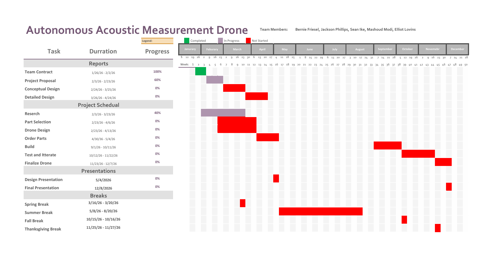

# Project Proposal

This document provides a comprehensive explanation of what a project proposal should encompass. The content here is detailed and is intended to highlight the guiding principles rather than merely listing expectations. The sections that follow contain all the necessary information to understand the requirements for creating a project proposal.

## General Requirements for the Document
- All submissions must be composed in markdown format.
- All sources must be cited unless the information is common knowledge for the target audience.
- The document must be written in third person.
- The document must identify all stakeholders including the instuctor, supervisor, and customer.
- The problem must be clearly defined using "shall" statements.
- Existing solutions or technologies that enable novel solutions must be identified.
- Success criteria must be explicitly stated.
- An estimate of required skills, costs, and time to implement the solution must be provided.
- The document must explain how the customer will benefit from the solution.
- Broader implications, including ethical considerations and responsibilities as engineers, must be explored.
- A list of references must be included.
- A statement detailing the contributions of each team member must be provided.

## Introduction

&nbsp; &nbsp; &nbsp; &nbsp; Have you ever been in a large stadium or venue where the sound was loud and clear, but something felt slightly off depending on where you were sitting? Sometimes music or speech can seem a little late, uneven, or less clear in certain areas. These issues often come from timing misalignment between speakers or from incomplete acoustic measurements of the space.

&nbsp; &nbsp; &nbsp; &nbsp; This project focuses not only on aligning delay towers, but also on improving overall acoustic measurement accuracy across the entire sound system. By using acoustic measurement tools and system-tuning software, we aim to create a practical, repeatable workflow for measuring system performance, making adjustments, and verifying results.

&nbsp; &nbsp; &nbsp; &nbsp; The goal is to ensure that speaker timing, coverage, and tonal balance are optimized throughout the venue, not just in one location. By improving how measurements are taken and applied, the project seeks to deliver clearer, more consistent sound for the entire audience.

&nbsp; &nbsp; &nbsp; &nbsp; The remainder of this proposal outlines the project goals, technical background, methodology, implementation plan, and the metrics used to evaluate overall system performance.

## Formulating the Problem

### Background

&nbsp; &nbsp; &nbsp; &nbsp; Modern live-event production depends on sound reinforcement systems capable of delivering consistent coverage, transparency, and tonal balance across diverse venues. Achieving these outcomes depends on accurately characterizing the propagation of acoustic energy throughout the listening environment. This includes the combined influences of direct sound, reflections, and reverberation. Sound-system engineering relies on heavily accurate acoustic measurements that are essential for properly aligning loudspeakers, applying equalization, and optimizing overall system performance. [1][2].

&nbsp; &nbsp; &nbsp; &nbsp; In current professional workflows, calibrated microphones are manually relocated throughout the audience space to gather measurement data. The data is then used to inform equalization, time alignment, and level optimization decisions. Although this methodology is well established and widely accepted, manually repositioning microphones limits how many measurement locations can realistically be sampled during the tight setup windows common in live-event production. As a result, the spatial resolution of the collected acoustic data is often limited, particularly in large, architecturally complex, or multi-tiered venues.

&nbsp; &nbsp; &nbsp; &nbsp; Using measurement-based system optimization (microphones and software to measure how a sound system actually performs in a room, then adjusting the speakers and settings to make it sound as clear, even, and balanced as possible) is commonly conducted using transfer-function and impulse-response techniques that quantify the relationship between the excitation signal produced by a loudspeaker system and the signal received at a measurement microphone. Industry-standard software such as Smaart is widely used in this process to capture, analyze, and interpret these measurements in real time.

&nbsp; &nbsp; &nbsp; &nbsp; The measured response at any given listener position reflects the combined influence of both the loudspeaker system and the acoustic environment. Consequently, spatial sampling across multiple listening positions is necessary to accurately characterize overall venue performance [1]. Because each acoustic measurement represents a localized response influenced by nearby boundaries and reflections, distributed measurement positions are required to evaluate coverage uniformity and system consistency throughout the audience area [2].

&nbsp; &nbsp; &nbsp; &nbsp; The acoustic response at a listener position may be modeled as the convolution of the excitation signal x(t) with the acoustic impulse response h(t) of the environment, producing the measured signal y(t):

$$
y(t)=x(t)∗h(t) \quad (1)
$$ 

&nbsp; &nbsp; &nbsp; &nbsp; Accurate estimation of h(t) across numerous spatial coordinates is therefore essential for developing reliable representations of venue acoustic behavior and achieving consistent system performance throughout the listening area. Spatial variations in reflections, room geometry, boundary conditions, and audience loading can produce measurable differences in response between nearby listener positions, underscoring the importance of spatially distributed measurement techniques [3].

&nbsp; &nbsp; &nbsp; &nbsp; Modern transfer-function measurement platforms provide highly accurate tools for analyzing magnitude, phase, and impulse-response characteristics of sound systems [4]. However, these tools remain dependent on manual microphone placement and therefore inherit practical limitations related to labor, accessibility, and time constraints. Large venues frequently include seating regions that are difficult to access, elevated balcony sections, or architectural features that limit measurement coverage. In such cases, engineers may be required to approximate acoustic performance in unmeasured areas, potentially resulting in uneven system optimization or additional adjustment time. These operational limitations motivate the exploration of automated measurement approaches capable of collecting spatially dense acoustic data in a more efficient and repeatable manner than traditional manual workflows.

### Specifications

**System Capabilities**

- The system shall autonomously navigate a defined measurement region within an indoor or outdoor performance venue.
- The system shall carry at least one calibrated measurement microphone capable of capturing impulse response, frequency response, and sound pressure level data.
- The system shall transmit collected acoustic data to a ground-station computer for real-time or post-measurement analysis.
- The system shall support synchronized excitation signals generated by the venue loudspeaker system for transfer-function measurement.
- The system shall include onboard processing hardware capable of managing sensor acquisition, navigation control, and data logging.

**Modularity and Expandability**

- The system shall allow replacement of sensing modules and processing components.
- The system may support additional environmental sensors, such as temperature or humidity sensors, to enable future acoustic-environment modeling.
- The system shall provide accessible data interfaces to support integration with external analysis platforms.

**Physical Reliability**

- The system shall maintain stable operation within typical indoor venue airflow conditions.
- The system shall include protective structures to safeguard sensing equipment during operation and transport.
- The system shall be capable of safe landing or shutdown in the event of communication or navigation failure.

### Constraints

**Regulatory Compliance**

- The system shall comply with applicable aviation and indoor drone operation regulations within the deployment region.
- Wireless communication systems shall operate within approved frequency allocations for unlicensed devices.

**Operational Guidelines**

- The system shall operate only within controlled environments approved for autonomous flight testing.
- The system shall not interfere with venue audio systems or measurement signals during operation.

**Safety and Environmental Guidelines**

- The system shall incorporate protective measures to prevent injury to personnel or damage to venue infrastructure.
- The system shall include emergency shutdown functionality to ensure safe operation in fault conditions.

## Survey of Existing Solutions

&nbsp; &nbsp; &nbsp; &nbsp;Several research efforts have explored the use of drones for acoustic measurement, noise analysis, and sound localization in different environments. Our team has surveyed existing academic solutions that most closely align with our objective of using a drone-based platform to capture acoustic data while mitigating drone self-noise. Two systems in particular help our design approach: **Urban Traffic Noise Analysis Using a UAV-Based Array of Microphones** and **An Acoustic Source Localization Method Using a Drone-Mounted Phased Microphone Array**.

---

### Urban Traffic Noise Analysis Using a UAV-Based Array of Microphones

&nbsp; &nbsp; &nbsp; &nbsp;This system presents a UAV-based platform designed to measure and map urban traffic noise in three dimensions. The researchers mounted a multi-microphone array on a drone and used onboard digital signal processing to reduce rotor noise and extract useful environmental sound data. The system records sound pressure levels (SPL) while tagging each measurement with altitude and position data, enabling the construction of 3D noise maps of urban environments. A major focus of the work is mitigating UAV self-noise using adaptive filtering and reference microphones oriented toward the rotors.

&nbsp; &nbsp; &nbsp; &nbsp;The system uses a large MEMS microphone array and performs real-time digital signal processing on an FPGA, including PDM-to-PCM conversion, FIR filtering, and adaptive least-mean-squares (LMS) noise cancellation. Reference microphones are used to model rotor noise, which is then subtracted from the measurement microphones. This architecture demonstrates that UAV-based acoustic measurement is feasible when supported by sufficient hardware and processing capability.

**Pros**

- **Demonstrated feasibility of UAV-based acoustic measurement:** Confirms that drones can be used to collect meaningful environmental sound data.  
- **Explicit handling of drone self-noise:** Uses reference microphones and adaptive LMS filtering to suppress rotor noise.  
- **3D noise mapping capability:** Combines audio data with altitude and positional metadata to generate spatial noise maps.  
- **High-performance DSP implementation:** FPGA-based processing enables parallel filtering and real-time operation.  

**Cons**

- **High system complexity:** Requires a large microphone array, FPGA development, and significant DSP expertise.  
- **Array-based measurement focus:** Emphasizes spatial noise mapping rather than single-point measurements.  
- **Post-processing dependence:** While adaptive filtering is used, the system is not optimized for real-time audio analysis.  
- **Limited portability of design:** The size of the array reduce viability in constrained environments such as concert venues.

**Gaps**

- **No focus on soundcheck measurements:** SPL accuracy suitable for professional audio tools is not addressed.  
- **No microphone separation strategy:** Drone noise mitigation relies primarily on DSP rather than physical separation of microphones.  
- **Limited relevance to indoor venues:** The system is primarily demonstrated in outdoor urban environments.  

**Takeaways**

- **Drone acoustic measurement is viable:** This work validates the core concept of airborne sound measurement.  
- **Drone self-noise must be addressed:** Adaptive filtering and reference sensors are necessary but not sufficient alone.  
- **Metadata is critical:** Position and altitude tracking are important for meaningful spatial interpretation of acoustic data.  
- **Simplification is needed:** For our project, a smaller number of microphones and a physically isolated measurement mic may provide better results.

---

### An Acoustic Source Localization Method Using a Drone-Mounted Phased Microphone Array

&nbsp; &nbsp; &nbsp; &nbsp;This research presents a drone-mounted phased microphone array designed to localize acoustic sources on the ground. The system uses a 32-channel MEMS microphone array arranged in a circular geometry beneath the drone. By exploiting phase differences between microphones, the system estimates the direction of arrival (DOA) of sound using delay-and-sum beamforming. The estimated DOA is then fused with drone navigation data (position and altitude) to compute the location of the sound source.

&nbsp; &nbsp; &nbsp; &nbsp;To mitigate drone self-noise, the authors use spectral subtraction across multiple frequency bands, modeling rotor noise separately from the signal of interest. This approach preserves phase information, which is critical for accurate localization. The system was tested using impulsive sound sources and was able to estimate sound directions with an average error of about 9–10 degrees at distances of roughly 150 meters.

**Pros**

- **High spatial awareness:** Phased array enables estimation of sound direction rather than simple amplitude measurement.  
- **Useful DSP techniques:** Uses spectral subtraction and delay-and-sum beamforming, both well-understood and implementable techniques.  
- **Navigation-audio fusion:** Demonstrates how IMU and position data must be integrated with acoustic processing.  
- **Quantified performance metrics:** Provides real-world error measurements for DOA estimation.  

**Cons**

- **Large microphone array requirement:** 32 microphones significantly increase system weight, power, and complexity.  
- **Focus on localization, not measurement accuracy:** The system prioritizes source direction over calibrated SPL values.  
- **Post-measurement processing:** Not designed for live audio analysis or real-time sound system measurements.  
- **Limited applicability indoors:** Accuracy depends on clear measurement paths and sufficient distance from reflective surfaces.

**Gaps**

- **No support for professional audio software:** Does not integrate with sound analysis tools used in live production.  
- **No mechanical noise isolation:** Microphones are rigidly mounted to the drone, increasing susceptibility to vibration and airflow noise.  
- **Unnecessary for point measurements:** The array of microphones may be unnecessary when only a single measurement point is required.  

**Takeaways**

- **Array processing improves spatial insight:** Directional information can be extracted using phase-based methods.  
- **Drone orientation matters:** Accurate acoustic interpretation requires fusing audio data with altitude and position information.  
- **Noise suppression must preserve phase:** Spectral subtraction is better for aggressive filtering when phase information is needed.  
- **Simpler strategies:** For soundcheck applications, a single calibrated microphone with physical isolation may outperform large arrays in accuracy and simplicity.

---

&nbsp; &nbsp; &nbsp; &nbsp;Together, these two systems demonstrate that drone-based acoustic sensing is technically feasible but highlight the trade-offs between complexity, accuracy, and applicability. While both approaches rely heavily on microphone arrays and advanced DSP to mitigate drone noise, our project seeks to simplify the architecture by prioritizing **physical microphone isolation**, **stable indoor flight**, and **compatibility with professional sound analysis tools**. The insights gained from these studies directly inform our design constraints, confirming the need for deliberate self-noise mitigation, precise spatial metadata, and a balance between system sophistication and real-world usability.

## Measures of Success

&nbsp; &nbsp; &nbsp; &nbsp; The success of this project will be evaluated based on the drone system’s ability to achieve precise flight control, maintain operational reliability, and perform accurate acoustic data acquisition during real-world testing and measurement scenarios.The following key performance indicators (KPIs) and verification methodologies will be used to ensure the system meets its control, sensing, safety, and acoustic measurement specifications while operating within defined technical and environmental constraints.

1. Flight Stability and Control Accuracy

Objective: Verify that the drone maintains stable and accurate flight control under varying operating conditions.

Methodology:

Hover Stability Testing: Conduct repeated hover trials to measure positional drift and stability over fixed time intervals.

Control Response Evaluation: Measure the drone’s response time and accuracy to pilot or programmed control inputs.

Disturbance Rejection: Introduce minor external disturbances (e.g., airflow variations) to evaluate stabilization performance.

Sensor Calibration Verification: Validate proper integration and calibration of IMU and onboard sensors for accurate orientation and motion tracking.

2. Autonomous and Signal Processing Performance

Objective: Ensure that the microcontroller and digital signal processing (DSP) components reliably interpret sensor data and execute control algorithms.

Methodology:

Data Processing Latency: Measure the time between sensor input acquisition and control output execution.

Algorithm Validation: Test filtering and control algorithms for consistency and noise reduction in sensor readings.

Communication Reliability: Verify stable data transmission between onboard modules and control interfaces.

Fail-Safe Logic Testing: Simulate signal loss or abnormal inputs to confirm proper autonomous safety responses.

3. System Integration and Hardware Reliability

Objective: Confirm that all hardware components, including the flight controller, sensors, power system, and communication modules, operate cohesively and reliably.

Methodology:

End-to-End System Testing: Perform full-flight trials to validate coordinated subsystem operation.

Component Stress Testing: Evaluate system performance under extended operation to identify overheating or instability.

Power System Evaluation: Monitor voltage levels, current draw, and battery performance during various flight modes.

Connection Integrity Checks: Ensure secure wiring, solder joints, and module interfaces under vibration conditions.

4. Safety and Operational Robustness

Objective: Verify that the drone operates safely and maintains controlled behavior in both normal and abnormal scenarios.

Methodology:

Emergency Shutdown Testing: Confirm reliable activation of kill-switch or emergency stop mechanisms.

Controlled Landing Trials: Evaluate the system’s ability to execute safe landings during low power or signal interruption.

Thermal Monitoring: Assess operating temperatures of critical electronics to prevent overheating risks.

Flight Boundary Testing: Ensure the drone maintains stable operation within defined operational limits.

5. Cost Efficiency and Expandability

Objective: Demonstrate that the drone system remains cost-effective while supporting future enhancements in control, sensing, and DSP capabilities.

Methodology:

Budget Assessment: Compare total system cost against initial project constraints and comparable commercial platforms.

Modular Design Review: Evaluate the ease of integrating additional sensors, DSP modules, or control upgrades.

Maintenance and Durability Analysis: Track component wear, repair frequency, and long-term usability.

Documentation Verification: Ensure clear technical documentation enables replication and future development.

&nbsp; &nbsp; &nbsp; &nbsp; By meeting these success criteria, the project will demonstrate a reliable, stable, and cost-effective drone system that successfully integrates microcontroller-based control and digital signal processing while maintaining safe operation and expandability for future research and development.

## Resources

&nbsp; &nbsp; &nbsp; &nbsp; The autonomous acoustic measurement drone will require a complete system-level design encompassing both the physical airframe and the hardware and software architectures that govern flight and data acquisition. This project demands a broad range of technical skills, including embedded systems design, CAD, digital signal processing and filtering, audio engineering, and control systems. Each of these disciplines must function cohesively to produce a platform capable of collecting clean acoustic data while maintaining stable, safe, and autonomous flight. Achieving both high-quality signal acquisition and reliable aerial performance requires careful integration across electrical, mechanical, and software subsystems.

&nbsp; &nbsp; &nbsp; &nbsp; For safe and reliable autonomous pathing in dynamic environments, the drone will require onboard sensing, state estimation, and real-time control logic. Although modern flight controllers provide basic stabilization, mission-level autonomy demands accurate positioning, obstacle awareness, and robust fail-safe behavior. The feasibility of consistent autonomous performance under varying conditions will be evaluated through iterative testing. This may involve sensor fusion between GPS, inertial measurement units, and proximity sensors, along with control tuning to maintain flight stability while executing onboard data processing.

&nbsp; &nbsp; &nbsp; &nbsp; Another major technical challenge of this project is maintaining acoustic signal quality during flight. Rotor vibration and wind turbulence can introduce significant disturbances into the audio captured by the onboard microphone. The team will evaluate mechanical isolation methods, sensor placement, and digital filtering techniques to reduce these disturbances. Controlled testing will be conducted to determine whether sufficient signal clarity can be achieved while remaining within budget constraints, power limitations, and microphone selection.

&nbsp; &nbsp; &nbsp; &nbsp; Throughout development, the team will utilize university laboratory equipment, open-source flight firmware, and commercially available components to support efficient prototyping and validation. Rapid prototyping tools such as 3D printing will enable iterative refinement of mounting structures and sensor placement as integration progresses.

&nbsp; &nbsp; &nbsp; &nbsp; As development advances, the team will apply systematic testing and iterative design practices to address challenges in autonomy and acoustic performance. By maintaining a strong focus on system-level integration and practical constraints, the team is confident in delivering a functional prototype that demonstrates the feasibility of autonomous acoustic measurement in real-world environments.

### Budget

&nbsp; &nbsp; &nbsp; &nbsp; The total estimated budget for this project is approximately $1,000–$1,500, which covers the essential components required to construct a functional prototype of an autonomous acoustic measurement drone. This includes the drone propulsion system, flight controller, onboard sensing hardware, battery systems, structural components, and acoustic isolation materials necessary for stable flight and reliable audio acquisition.

&nbsp; &nbsp; &nbsp; &nbsp; The budget is intentionally constrained by prioritizing commercially available components, open-source flight firmware, and university-provided laboratory resources. By leveraging in-house prototyping tools such as 3D printing and existing testing equipment, the team aims to minimize cost while maintaining system performance and reliability.

| **Item**                         | **Description**                                         | **Estimated Cost**      |
|----------------------------------|---------------------------------------------------------|--------------------------|
| **3D Printing Filament**         | Material for producing the body of the drone.           | $40 – $80                |
| **Motors (4x)**                  | Brushless motors selected for stable thrust             | $160 – $240              |
| **Electronic Speed Controllers (ESCs)** | Motor controllers that ensure stable and efficient propulsion. | $70 – $100              |
| **Propellers (Sets + Spares)**   | Propellers optimized for stability and efficiency | $10 – $30                |
| **Battery (LiPo/Li-ion)**               | Primary onboard power source sized for payload and flight duration | $100 – $200              |
| **Flight Controller**            | Central flight control unit responsible for stabilization, navigation, and autonomous path execution. | $150 - $200       |
| **GPS Module**                   | Provides positioning data for autonomous navigation | $40 – $60                |
| **Vibration Isolation Materials**| Damping materials and mounting hardware to reduce mechanical interference | $30 – $80       |
| **Wiring, Connectors, Hardware** | Electrical connectors, cabling, and integration components | $25 – $50        |

### Personel

**Faculty:**

Instructor - Dr. Johnson will be the team's instructor. Dr. Johnson will meet with the team weekly to review progress, provide feedback, and offer guidance as needed. He will help ensure the project remains on track and meets overall expectations.

Advisor - Owen O’Connor will be the project's advisor. He will provide technical guidance throughout the project with particular emphasis on embedded systems. He will assist with system design decisions and help address technical challenges as they arise to ensure a reliable and well-executed solution.

Customer - Audio Company will be as the project’s customer and provide industry-based direction throughout development. They will help define system requirements, performance expectations, and practical constraints to ensure the final solution aligns with current industry standards. Ongoing communication with Audio Company will help guide design decisions and ensure the completed project delivers real-world value.

**Team Members:**

Bernie Friesel - Experience in power systems, controls, and digital signal processing, supported by coursework and laboratory experience. Strong background in circuit design and construction. Proficient in C/C++ and MATLAB programming, with experience in digital system design, microcontrollers, and microprocessors.

Jackson Phillips - Strong background in FPGA and microcontroller programming, supported by coursework in digital system design and computer architecture. Experience in signals and telecommunications with familiarity in DSP concepts. Proficient in C, C++, and VHDL, with foundational knowledge in power systems.

Sean Ike - Strong background in CAD, FPGA development, and microcontroller-based systems. Experience in circuit design and construction, supported by coursework in power systems. Proficient in C, C++, and VHDL, with working knowledge of MATLAB and foundational experience in DSP through signals and telecommunications.

Mashoud Modi - Strong background in embedded systems, microcontrollers, and digital system design. Coursework includes Signals and Systems, Digital System Design, Microcontrollers, PLCs, and Control Systems with lab experience focused on system modeling and implementation. Proficient in C programming and experienced in hardware/software integration and debugging.

Elliot Lovins - Strong background in CAD, control systems, and physical system design. Competitive robotics experience has strengthened skills in system integration and troubleshooting. Proficient in C/C++ and MATLAB, with coursework in control systems, signals, and telecommunications. Hands-on experience with microcontrollers through robotics and project development.

### Timeline

&nbsp; &nbsp; &nbsp; &nbsp; The capstone team has one academic year to design and develop an autonomous acoustic measurement drone. During the first semester, the focus will be on research, system architecture, part selection, and detailed design to ensure all major decisions are finalized before summer. The second semester will concentrate on building, integrating, testing, and refining the prototype. If the team follows the timeline outlined in the Gantt chart, the project will result in a functional and validated prototype by December 2026.

## Specific Implications

&nbsp; &nbsp; &nbsp; &nbsp; Faster setup and tuning cycles represent one of the most immediate operational advantages of the proposed system. In current workflows, engineers must manually position measurement microphones, run test signals, interpret the results, and then physically relocate the microphones across multiple listening zones such as front fills, side seating, and balcony areas. While this process is reliable, it is inherently time-intensive and often constrained by crew availability, venue access, and tight production schedules. An automated acoustics measurement drone streamlines this process by navigating a predefined sequence of waypoints and collecting data autonomously. By reducing the need for repeated manual repositioning, the system compresses the traditional “measure → adjust → verify” loop into fewer and more efficient iterations, allowing engineers to focus more on analysis and system optimization rather than physical logistics.

&nbsp; &nbsp; &nbsp; &nbsp; Higher spatial resolution in acoustic assessment significantly enhances the quality of tuning decisions. In practice, measurement positions are often limited because each additional data point requires more time for setup, signal playback, and verification. Consequently, engineers frequently rely on a small set of representative listening locations, which may overlook localized anomalies such as hot spots, dead zones, or narrowband frequency inconsistencies. A drone-enabled measurement process allows for a substantially greater number of measurement points to be collected within the same time window. This denser dataset provides more comprehensive venue coverage, enabling clearer identification and quantification of coverage gaps and frequency-dependent issues that might otherwise remain undetected.

&nbsp; &nbsp; &nbsp; &nbsp; Improved confidence in system adjustments emerges from the ability to visualize acoustic coverage patterns derived from higher-density measurements. Traditionally, engineers balance predictive modeling with a limited set of real-world measurements, and when discrepancies arise, they must infer system behavior between measured points based largely on experience and professional judgment. By contrast, a drone-based approach enables the generation of detailed spatial coverage maps that reveal acoustic trends across the entire venue. These visualizations support more evidence-based decisions regarding equalization, delay alignment, level balancing, and loudspeaker aiming, ultimately strengthening both the technical justification and reliability of tuning adjustments.

&nbsp; &nbsp; &nbsp; &nbsp; Repeatable measurement runs further contribute to consistent and verifiable system performance across events. Conventional measurement sessions often vary due to slight differences in microphone placement, restricted access to certain seating areas, or variations in technician methodology. Such inconsistencies make it difficult to perform accurate before-and-after comparisons or to replicate a proven tuning strategy across multiple deployments. An autonomous drone system can execute identical waypoint paths or venue-specific templates during each measurement session, ensuring consistent data collection conditions. This repeatability enables engineers to validate improvements more rigorously, document tuning outcomes with greater precision, and develop standardized workflows that can be reliably reproduced in future productions.

&nbsp; &nbsp; &nbsp; &nbsp; Adaptability across diverse venue types underscores the practical value of the system. Each new venue typically requires engineers to redesign their measurement plan from the ground up, selecting accessible microphone positions while balancing time constraints and logistical limitations. This often results in uneven measurement density and reduced data quality in complex or restrictive spaces. A drone-based platform allows the core measurement framework to remain consistent while scaling the waypoint grid to suit different room geometries, seating layouts, and target listening zones such as floor, balcony, and VIP sections. As a result, the workflow becomes more efficient, scalable, and practical across a wide range of venues while still preserving the flexibility to focus on acoustically problematic areas when necessary.

## Broader Implications, Ethics, and Responsibility as Engineers

The proposed autonomous acoustic-measurement drone system extends beyond a technical solution for venue sound optimization. Its implementation carries broader global, economic, environmental, and societal implications that must be carefully evaluated. As engineers, the project team bears responsibility for ensuring that innovation is pursued in a manner that prioritizes safety, equity, transparency, sustainability, and regulatory compliance.

### Global and Industry Impacts

The live-event industry is a global enterprise encompassing concerts, conferences, houses of worship, sporting venues, and cultural institutions. A system capable of rapidly collecting spatially dense acoustic data may significantly improve sound-system commissioning workflows worldwide. By enabling more comprehensive acoustic characterization, the technology may contribute to improved listener experiences across diverse cultural and geographic contexts. The importance of accurate spatial measurement in achieving consistent system performance is well documented in professional sound engineering literature [1][2].

Automated acoustic mapping may improve system verification by allowing more measurement locations to be sampled than is typically practical with manual microphone placement methods [2][4]. However, automation shall not replace professional judgment. The system shall function as a decision-support tool that complements the expertise of trained system engineers.

### Economic Implications

The system may reduce labor hours associated with manual microphone relocation and repeated measurement passes. Improved spatial coverage may decrease troubleshooting time during system commissioning, thereby lowering operational costs for production companies and venue operators. Traditional workflows described in established references emphasize manual processes that are labor intensive [1][2].

Automation may influence workforce dynamics. Therefore, the system shall be positioned as a tool that enhances human capability rather than replaces skilled technicians. Engineers and technicians will remain essential for interpretation, artistic voicing decisions, and final system optimization [4].

### Environmental Considerations

The environmental footprint of the system shall be evaluated throughout its lifecycle. Considerations include battery production, energy consumption, material sourcing, and electronic waste disposal.

To mitigate environmental impact:

The system shall prioritize energy-efficient components and optimized flight algorithms.

Rechargeable battery systems with extended cycle life shall be selected.

Modular construction shall allow component replacement instead of full-system disposal.

Responsible e-waste recycling procedures shall be followed.

Acoustic engineering references emphasize responsible SPL management and system efficiency, which indirectly supports reduced environmental and community noise impact [1][3].

### Regulatory Compliance and Operational Governance

Regulatory compliance is a fundamental engineering requirement. The system shall adhere to all applicable aviation, wireless communication, electrical safety, and occupational safety regulations.

#### FAA Compliance

If operated within the United States, the system shall comply with Federal Aviation Administration (FAA) regulations. For outdoor or partially open venues:

The system shall comply with 14 CFR Part 107 – Small Unmanned Aircraft Systems, including pilot certification, aircraft registration, and operational limitations [5].

The system shall comply with Remote Identification (Remote ID) requirements when applicable [5].

Airspace authorization shall be obtained when operating near controlled airspace.

The system shall avoid flight over uninvolved persons unless authorized under FAA operational categories.

Even when operating indoors, the project shall voluntarily align with FAA safety principles to maintain best-practice standards.

Indoor Venue Safety and OSHA Compliance

For indoor deployment:

Operation shall comply with Occupational Safety and Health Administration (OSHA) safety guidelines [6].

The drone shall not operate above occupied seating areas during public events.

Deployment shall occur only during controlled commissioning periods.

Venue management approval shall be obtained prior to operation.

#### FCC and RF Compliance

Wireless communication modules shall comply with FCC Part 15 regulations governing unlicensed radio frequency devices [7].

Transmitters shall operate within approved frequency bands and power limits.

The system shall avoid interference with wireless microphones, in-ear monitoring systems, and venue communication infrastructure.

RF coordination shall be conducted in spectrum-dense environments.

Battery and Electrical Safety

Lithium battery systems shall comply with recognized electrical safety standards:

Certified battery packs shall be used.

Integrated battery management systems (BMS) shall prevent overcharge, deep discharge, and thermal runaway.

Thermal monitoring shall be implemented.

### Acoustic Exposure Compliance

Acoustic excitation signals shall remain within safe exposure limits defined by OSHA occupational noise standards [6].

Personnel shall use hearing protection when required.

Measurement durations shall be controlled to prevent unsafe cumulative exposure.

Responsible sound-pressure management aligns with established acoustic engineering practices [1][3].

### Safety and Public Welfare

Protecting public safety is the highest ethical obligation of engineers. The system shall incorporate:

Redundant emergency shutdown mechanisms.

Controlled landing protocols.

Geofencing and firmware-enforced altitude limits.

Pre-flight risk assessment documentation.

Safety constraints shall override performance objectives. If safety risks are identified, deployment shall be paused until corrective measures are implemented.

Privacy and Data Responsibility

Although the system primarily collects acoustic data, onboard navigation sensors may capture incidental information. Therefore:

Data collection shall be limited strictly to acoustic and positional parameters necessary for analysis.

Visual recording shall be minimized or disabled unless required.

Wireless transmissions shall be encrypted.

Data retention shall comply with institutional and contractual policies.

Transfer-function measurement systems are intended to evaluate system performance, not personal information [4]. The proposed system shall maintain this narrow technical scope.

### Professional and Ethical Responsibility

Each team member shall uphold professional engineering ethics by:

Prioritizing safety, transparency, and reliability.

Accurately reporting performance data without exaggeration.

Clearly documenting system limitations.

Avoiding unsafe testing practices.

Sound-system engineering literature emphasizes disciplined measurement and verification [1][4]. The same rigor shall be applied to the aerial measurement platform.

### Societal and Accessibility Considerations

Improved sound consistency may enhance accessibility for individuals with hearing impairments by reducing spatial inconsistencies and excessive reverberation. More uniform coverage may also reduce the need for excessive volume levels. The relationship between spatial acoustic variation and listener perception is well established [2][3].

By striving for equitable acoustic performance throughout all seating areas—not only premium sections—the project supports fairness and inclusivity in audience experience.

The broader implications of this project extend beyond technical innovation. The autonomous acoustic-measurement system has the potential to improve industry workflows, enhance audience experience, and reduce commissioning time. However, these benefits must be balanced with strict adherence to safety, environmental responsibility, privacy protection, workforce considerations, and regulatory compliance.

By aligning system design with established principles in sound-system engineering and federal regulatory standards, the project advances technological capability while upholding the paramount obligation of engineers: to protect public welfare and serve society responsibly.

## References

[1] D. Davis and E. Patronis, Sound System Engineering, 4th ed. New York, NY, USA: Focal Press, 2013.

[2] G. Ballou, Ed., Handbook for Sound Engineers, 5th ed. New York, NY, USA: Focal Press, 2015.

[3] F. A. Everest and K. Pohlmann, Master Handbook of Acoustics, 6th ed. New York, NY, USA: McGraw-Hill, 2015.

[4] M. Lawrence, Between the Lines: Concepts in Sound System Design and Alignment. Petaluma, CA, USA: Rational Acoustics, 2016.

[5] Federal Aviation Administration, 14 CFR Part 107 – Small Unmanned Aircraft Systems, U.S. Department of Transportation, Washington, DC, USA.

[6] Occupational Safety and Health Administration, Occupational Noise Exposure Standard (29 CFR 1910.95), U.S. Department of Labor, Washington, DC, USA.

[7] Federal Communications Commission, Title 47 CFR Part 15 – Radio Frequency Devices, Washington, DC, USA.

[8] M. Pham, “Sound check! crafting acoustics for performance - USC viterbi school of engineering,” USC Viterbi School of Engineering - USC Viterbi School   of Engineering, https://illumin.usc.edu/crafting-acoustics-for-performance/ (last accessed Feb. 23, 2026). 

[9] J. Bedard, “How do we measure SPL? A guide to SPL metrics,” Rational Acoustics, https://support.rationalacoustics.com/support/solutions/articles/150000183624-spl-metrics-and-weighting-guide (last accessed Feb. 23, 2026). 

[10] J. Bedard, “How to create SPL reports in Smaart,” Rational Acoustics, https://support.rationalacoustics.com/support/solutions/articles/150000195027-how-to-create-spl-reports-in-smaart (last accessed Feb. 23, 2026). 

[11] J. Bedard, “Measurement 101: Types of measurement,” Rational Acoustics, https://support.rationalacoustics.com/support/solutions/articles/150000190431-measurement-101-types-of-measurement (last accessed Feb. 23, 2026). 

[12] J. Bedard, “IR measurements, part 1: Pre-Smaart Preparation,” Rational Acoustics, https://support.rationalacoustics.com/support/solutions/articles/150000191163-ir-measurements-part-1-pre-smaart-preparation (last accessed Feb. 23, 2026). 

## Statement of Contributions

Each team member must contribute meaningfully to the project proposal. In this section, each team member is required to document their individual contributions to the report. One team member may not record another member's contributions on their behalf. By submitting, the team certifies that each member's statement of contributions is accurate.

Sean: Specific Implications along with its respective references.